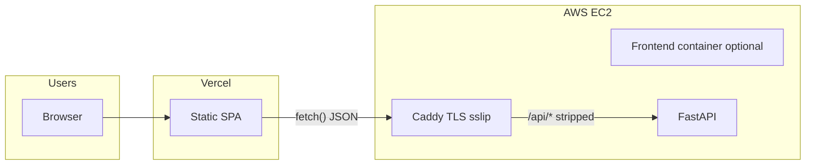

# CI/CD: production deployment (Vercel + EC2)

This document describes how **GitHub Actions** can deploy **Cloud Networking Studio** in the split layout from Step 30:

- **Browser UI:** Vercel (static Vite build). Users bookmark and share only the Vercel URL.
- **Control-plane API:** Terraform-managed **EC2** running `docker-compose.prod.yml` plus **`docker-compose.sslip.yml`**, with HTTPS on **`https://<Elastic IP>.sslip.io`** and paths under **`/api/*`** routed to FastAPI.
- **Why the API URL is “hidden”:** The Vercel build bakes **`VITE_API_BASE_URL`** (at build time) to the sslip API base. The SPA calls the EC2 origin from JavaScript; users do not need to type the EC2/sslip URL unless they open devtools or share API links.

## Architecture (high level)



- **Vercel** serves the SPA and handles client-side routing (`frontend/vercel.json` rewrites).
- **EC2 Caddy** terminates TLS for `*.sslip.io` and proxies **`/api/*`** to the backend (same behavior as HTTP-only `deploy/Caddyfile.prod` on port 80).

## Vercel project settings

| Setting | Value |
|--------|--------|
| Root directory | `frontend` |
| Build command | `npm run build` (CI uses `vercel build` with the same env; see workflow) |
| Output directory | `dist` |
| Environment variable (Production) | `VITE_API_BASE_URL` = `https://<EIP>.sslip.io/api` (no trailing slash after `api`) |

Example:

```bash
VITE_API_BASE_URL=https://203.0.113.7.sslip.io/api
```

Copy **`frontend/.env.example`** when developing against a remote API.

## Terraform and durable state

The **Deploy production** workflow (`.github/workflows/deploy-production.yml`) runs **`terraform apply`** on every push to **`main`**. To **reuse** the same EC2/VPC/EIP across runs, Terraform state must live in a **remote backend** (recommended: **S3**).

1. Create an S3 bucket (and optionally a DynamoDB table for state locking).
2. Add repository secret **`TF_STATE_BUCKET`** (required for that workflow).
3. Optional: **`TF_STATE_KEY`** (defaults to `cloud-networking-studio/prod/terraform.tfstate`).
4. Optional: **`TF_STATE_DYNAMODB_TABLE`** for lock coordination.

The repo declares a partial **`backend "s3" {}`** in `infra/terraform/versions.tf`. Local developers can use:

- `terraform init -backend-config=backend.local.hcl` (see `backend.s3.hcl.example`), or  
- `terraform init -backend=false` for throwaway local state.

**The production workflow does not run `terraform destroy`.** Destroy is manual or a separate process.

## EC2 bootstrap (one-time)

Before the first automated deploy can succeed, the instance must have a repo checkout directory and a **`.env`** file (not committed) with at least:

- Strong **`POSTGRES_PASSWORD`** (and matching **`DATABASE_URL`** if you override it).
- **`CNS_CORS_ORIGINS`** including your **Vercel production origin** (and any preview origins you care about), **`https://<EIP>.sslip.io`**, and local dev URLs as needed.
- Optional **`CNS_CORS_ORIGIN_REGEX`** for patterns such as Vercel preview hosts (see `backend/.env.example`).

The workflow **appends `SSLIP_HOST=<EIP>.sslip.io`** on each deploy and runs:

```bash
docker compose -f docker-compose.prod.yml -f docker-compose.sslip.yml --env-file .env up -d --build
```

Plain **`docker-compose.prod.yml`** alone remains valid for **HTTP-only** local or EC2 setups (`deploy/Caddyfile.prod`).

## GitHub Actions: `deploy-production.yml`

On **`push` to `main`** (and **`workflow_dispatch`**), the workflow:

1. Runs **backend pytest** (with Postgres service on the runner).
2. Validates **`docker-compose.prod.yml`** via `docker compose config`.
3. Builds the **frontend** once with default Vite env (sanity compile before cloud steps).
4. Runs **`terraform fmt -check`**, **`terraform init`** (S3), **`validate`**, **`plan`**, **`apply`**.
5. Reads outputs: **`public_ip`**, **`sslip_host`**, **`stack_base_url_sslip`**, **`api_base_url_sslip`**.
6. **SSH** to the instance: clone or update repo, **`git checkout` the pushed SHA**, refresh **`SSLIP_HOST`**, bring up **Compose + sslip overlay**.
7. Runs **`scripts/prod_smoke_test.sh`** with **`CNS_BASE_URL=${stack_base_url_sslip}`** (waits longer for ACME via **`CNS_WAIT_ATTEMPTS`**).
8. Runs **`vercel pull` / `vercel build` / `vercel deploy --prebuilt --prod`** with **`VITE_API_BASE_URL`** set to **`api_base_url_sslip`**.

## CORS

Browsers load the SPA from **Vercel** (`https://*.vercel.app`) but call the API on **`https://<EIP>.sslip.io`** — that is **cross-origin**. FastAPI must allow the **Vercel** origin(s) via:

- **`CNS_CORS_ORIGINS`** — e.g. `https://your-project.vercel.app`, `http://localhost:5174`, …
- **`CNS_CORS_ORIGIN_REGEX`** (optional) — e.g. `^https://.*\.vercel\.app$` for previews (tighten to your org policy).

You typically **do not** add the sslip URL as a CORS “browser origin” unless another page hosted on sslip calls the API cross-origin; same-origin calls from the EC2-hosted SPA already work when that SPA is served from the same host as `/api`.

## Required secrets (summary)

| Area | Secret / variable | Purpose |
|------|-------------------|---------|
| AWS | `AWS_ACCESS_KEY_ID`, `AWS_SECRET_ACCESS_KEY` | Terraform + API access |
| AWS | `AWS_REGION` | Region for provider, S3 backend, and `TF_VAR_aws_region` |
| Terraform | `TF_STATE_BUCKET`, optional `TF_STATE_KEY`, `TF_STATE_DYNAMODB_TABLE` | **Production only** — remote state |
| Terraform | `TF_VAR_KEY_NAME` (workflow maps to env `TF_VAR_key_name`), `TF_VAR_SSH_ALLOWED_CIDR` | EC2 key pair name; SSH ingress CIDR |
| Terraform | Optional `TF_VAR_PROJECT_NAME`, `TF_VAR_ENVIRONMENT` | Default to `cns` and `prod` when unset |
| EC2 | `EC2_SSH_PRIVATE_KEY` | PEM for `appleboy/ssh-action` |
| EC2 | `EC2_SSH_USER` | e.g. `ubuntu` |
| Vercel | `VERCEL_TOKEN`, `VERCEL_ORG_ID`, `VERCEL_PROJECT_ID` | `vercel pull` / `build` / `deploy` |

Never commit keys, `terraform.tfvars`, or tokens. Fork PRs do not receive secrets (ephemeral workflow skips them).

See **`docs/EPHEMERAL_CI_ENVIRONMENTS.md`** for ephemeral-specific behavior.
