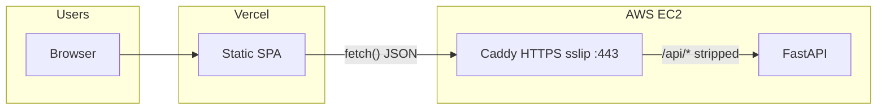

# CI/CD: production deployment (Vercel + EC2)

This document describes **Step 31** GitHub Actions deployment: **push to `main`** updates a **persistent** Terraform-managed EC2 stack, runs **HTTPS** smoke on sslip (Caddy uses **`deploy/Caddyfile.sslip`** with **`CADDYFILE_SSLIP`** and Let's Encrypt on **:443**), builds the **Vercel** frontend with **`VITE_API_BASE_URL`** defaulting to the **HTTPS** API origin, and **never** runs `terraform destroy`. **PR ephemeral** stays **HTTP-only** on sslip — see **`docs/EPHEMERAL_CI_ENVIRONMENTS.md`**.

## Main (`deploy-production.yml`) vs PR (`ephemeral-infra-smoke.yml`)

| | **Production (push `main`)** | **Ephemeral (PR / manual)** |
|--|------------------------------|-----------------------------|
| **Terraform state** | Same S3 bucket, fixed key (default `cloud-networking-studio/prod/terraform.tfstate`) | Same bucket, **unique** key per run: `cloud-networking-studio/ephemeral/<run_id>/terraform.tfstate` |
| **Infra lifetime** | **Keeps** VPC/EC2/EIP across runs | **Creates** stack, then **`terraform destroy`** in `always()` |
| **EC2 directory** | `~/cloud-networking-studio` (persistent clone) | `~/cloud-networking-studio-ephemeral` (fresh clone) |
| **Caddy on EC2** | **HTTPS** on **`https://<EIP>.sslip.io`** (`CADDYFILE_SSLIP=./deploy/Caddyfile.sslip`, **`CNS_CADDY_AUTO_HTTPS=on`**, **`CNS_CADDY_SITE_ADDRESS=<EIP>.sslip.io`**) | **HTTP :80** only (`CADDYFILE_SSLIP=./deploy/Caddyfile.prod`, **`CNS_CADDY_AUTO_HTTPS=off`**) |
| **Smoke** | **`https://<EIP>.sslip.io`** (`stack_base_url_sslip`) | **`http://<EIP>.sslip.io`** (`stack_base_url_sslip_http`) |
| **Vercel API URL** | Optional secret **`VERCEL_VITE_API_BASE_URL`**; else Terraform **`api_base_url_sslip`** (HTTPS **`…/api`**) | N/A (no Vercel in ephemeral job) |

## Architecture (high level)



- **Vercel** serves the SPA; the browser calls the **EC2** API origin baked into **`VITE_API_BASE_URL`** at build time (production CI defaults to **`https://<EIP>.sslip.io/api`**).
- **EC2 Caddy** serves **HTTPS** on **`https://<EIP>.sslip.io`** using **`deploy/Caddyfile.sslip`** (TLS site **`{$CNS_SSLIP_HOST}`**) and **HTTP :80** for the same routes. The security group allows **22 / 80 / 443**; **`docker-compose.sslip.yml`** publishes **443:443**.

## Vercel project settings

In the **Vercel dashboard** (Project → Settings → General), align with **`deploy-production.yml`**:

| Setting | Value |
|--------|--------|
| **Root Directory** | **Repository root** — leave **empty** (or `./`). **Do not** set this to **`frontend`**. |

**Why:** CI builds the SPA with **Vite** on the runner (`cd frontend`, `npm ci`, `VITE_API_BASE_URL=… npm run build`), producing **`frontend/dist`**. It then deploys **static files only** from the **monorepo root** with:

```bash
npx vercel@54.0.0 deploy frontend/dist --prod --yes --token "$VERCEL_TOKEN"
```

If **Root Directory** is **`frontend`**, Vercel resolves that path again under `frontend/` and can error with paths like **`frontend/dist/frontend`**.

CI runs **`vercel pull`** inside **`frontend/`** for project linking (`.vercel` next to the app). It does **not** run **`vercel build`** (no Vercel remote build) and does **not** use **`--prebuilt`**.

**Production API base (CI):** Optional repository secret **`VERCEL_VITE_API_BASE_URL`** (e.g. `https://203.0.113.7.sslip.io/api`). If unset, CI uses Terraform **`api_base_url_sslip`** as **`VITE_API_BASE_URL`** for the local **`npm run build`**.

Example (matches production EC2 HTTPS default):

```bash
VITE_API_BASE_URL=https://203.0.113.7.sslip.io/api
```

Copy **`frontend/.env.example`** when developing against a remote API.

## Terraform and durable state

The **Deploy production** workflow (`.github/workflows/deploy-production.yml`) runs **`terraform apply`** on every push to **`main`**. To **reuse** the same EC2/VPC/EIP across runs, Terraform state must live in a **remote backend** (recommended: **S3**).

1. Create an S3 bucket (and optionally a DynamoDB table for state locking).
2. Add repository secret **`TF_STATE_BUCKET`** (required for that workflow).
3. Optional: **`TF_STATE_KEY`** (defaults to `cloud-networking-studio/prod/terraform.tfstate`).
4. Optional: **`TF_STATE_DYNAMODB_TABLE`** for lock coordination.

The repo declares a partial **`backend "s3" {}`** in `infra/terraform/backend.tf` (merged with `versions.tf`). Local developers can use:

- `terraform init -backend-config=backend.local.hcl` (see `backend.s3.hcl.example`), or  
- `terraform init -input=false -reconfigure -backend-config=backend.local.hcl` for a dedicated non-CI state file.

**The production workflow does not run `terraform destroy`.** Destroy is manual or a separate process.

## EC2 bootstrap and `.env`

**GitHub Actions (`deploy-production.yml`):** before **Terraform apply**, the workflow checks repository secrets **`RDS_PASSWORD` or `POSTGRES_PASSWORD`** (either satisfies the DB secret requirement) and **`CNS_CORS_ORIGINS`**. On the instance, the SSH step **writes** **`~/cloud-networking-studio/.env`** from secrets and Terraform outputs (no secret values in logs). Production includes **`SSLIP_HOST`**, **`CADDYFILE_SSLIP=./deploy/Caddyfile.sslip`**, **`CNS_CADDY_SITE_ADDRESS=<EIP>.sslip.io`**, **`CNS_CADDY_AUTO_HTTPS=on`**, **`DATABASE_URL`** (Compose **`postgres`** service when RDS outputs are empty, otherwise **RDS** built from **`rds_address`** / **`rds_*`** outputs + the same password secret), and related **`CNS_*`** keys so Caddy serves **HTTPS** on sslip (Let's Encrypt) and **HTTP :80**. **`set +x`** is used while secrets are expanded; only **`.env` key names** are printed after write.

**Optional AWS RDS:** set repository variable **`RDS_ENABLED=true`** so **`terraform apply`** passes **`TF_VAR_rds_enabled=true`**. Terraform outputs **`rds_address`**, **`rds_port`**, **`rds_database_name`**, and **`rds_username`** (never the password). The SSH deploy step omits Compose profile **`localdb`** when **`rds_address`** is non-empty so the **`postgres`** container is not started. See **`docs/RDS.md`**.

**`CNS_CORS_ORIGINS`** on the EC2 backend must allow the **Vercel** origin(s) and the **EC2 API origins** **`https://<EIP>.sslip.io`** and **`http://<EIP>.sslip.io`** (and `http://localhost` for local tools) as needed. See `backend/.env.example`.

**`docker-compose.prod.yml`** reads **`POSTGRES_*`**, **`DATABASE_URL`**, **`CNS_*`**, etc. from **`.env`** when you pass **`--env-file .env`** (as the workflow does).

**Bundled Postgres** on EC2 uses **`--profile localdb`**. When Terraform **`rds_address`** is non-empty, the SSH step uses plain **`sudo docker compose`** (no profile) and **`DATABASE_URL`** points at **RDS**. Example with bundled Postgres:

```bash
sudo docker compose --profile localdb -f docker-compose.prod.yml -f docker-compose.sslip.yml --env-file .env up -d --build
```

Plain **`docker-compose.prod.yml`** alone remains valid for **HTTP-only** local setups (`deploy/Caddyfile.prod`). **Bundled Postgres** requires **`--profile localdb`** on every `docker compose` invocation that should start **`postgres`**.

## GitHub Actions: `deploy-production.yml`

On **`push` to `main`** (and **`workflow_dispatch`**), the **`deploy`** job:

1. Runs **backend pytest** (with Postgres service on the runner).
2. Validates **`docker-compose.prod.yml`** via `docker compose config` (with and without **`--profile localdb`**).
3. **Require EC2 deploy secrets:** fails early if **`CNS_CORS_ORIGINS`** is unset or if both **`RDS_PASSWORD`** and **`POSTGRES_PASSWORD`** are unset (either DB secret alone is enough).
4. Sets up **Node.js 20** (for the Vercel deploy step).
5. Runs **Terraform** under **`infra/terraform`**: **`backend.ci.hcl`**, **`terraform init`**, **`fmt -check`**, **`validate`**, **`plan`**, **`apply`**, **`terraform output`** (including sslip URLs for smoke, CORS, Vercel defaults, and optional **`rds_*`** fields when **`RDS_ENABLED`** is true). When **`RDS_ENABLED`**, **`TF_VAR_rds_master_password`** is taken from **`RDS_PASSWORD`** or **`POSTGRES_PASSWORD`**.
6. **Wait for SSH** until **TCP port 22** on **`public_ip`** accepts connections.
7. **SSH** (`appleboy/ssh-action`): **`cloud-init`**, **Docker** install if needed, clone/update **`~/cloud-networking-studio`**, **`git checkout`** pushed SHA, **write `.env`**, **`docker compose … up -d --build`** (with **`--profile localdb`** only when not using RDS; **compose logs** only if config/up fails).
8. **`scripts/prod_smoke_test.sh`** with **`CNS_BASE_URL`** = **`stack_base_url_sslip`** (HTTPS).
9. **`curl -vk https://<EIP>.sslip.io/api/health`** on the runner (explicit HTTPS check).
10. **Vercel (static `dist`):** from the **repository root**, **`cd frontend`**, **`npm ci`**, **`VITE_API_BASE_URL=… npm run build`**, **`npx vercel@54.0.0 pull`** (linking), then **`npx vercel@54.0.0 deploy frontend/dist --prod --yes`**. No **`vercel build`** and no **`--prebuilt`**.

**SSH CIDR:** for **local or manual** Terraform, use **`ssh_allowed_cidr = "<MY_PUBLIC_IP>/32"`** in **`terraform.tfvars`**. For **`deploy-production.yml`**, set secret **`TF_VAR_SSH_ALLOWED_CIDR`** appropriately for who may SSH to the instance. **Ephemeral** forces **`0.0.0.0/0`** for GitHub-hosted runners (see **`docs/EPHEMERAL_CI_ENVIRONMENTS.md`**).

`hashicorp/setup-terraform` installs the Terraform CLI with **`terraform_wrapper: false`**.

## CORS

Browsers load the SPA from **Vercel** (`https://*.vercel.app`) but call the **EC2** API on **`https://<EIP>.sslip.io`** (production default) — that is **cross-origin**. FastAPI must allow the **Vercel** origin(s) and the **EC2 API origin(s)** (`https://…` and optionally `http://…`) via **`CNS_CORS_ORIGINS`** (and optional **`CNS_CORS_ORIGIN_REGEX`** for previews).

## Required secrets (summary)

| Area | Secret / variable | Purpose |
|------|-------------------|---------|
| AWS | `AWS_ACCESS_KEY_ID`, `AWS_SECRET_ACCESS_KEY` | Terraform + API access |
| AWS | `AWS_REGION` | Region for provider, S3 backend, and `TF_VAR_aws_region` |
| Terraform | `TF_STATE_BUCKET`, optional `TF_STATE_KEY`, `TF_STATE_DYNAMODB_TABLE` | **Production** remote state |
| Terraform | `TF_VAR_KEY_NAME` (workflow maps to env `TF_VAR_key_name`), `TF_VAR_SSH_ALLOWED_CIDR` | EC2 key pair name; SSH ingress CIDR |
| Terraform | Optional `TF_VAR_PROJECT_NAME`, `TF_VAR_ENVIRONMENT` | Default to `cns` and `prod` when unset |
| Terraform | Optional repository variable **`RDS_ENABLED`** (`true` / unset) | When **`true`**, sets **`TF_VAR_rds_enabled=true`** for optional **RDS PostgreSQL** (see **`docs/RDS.md`**) |
| EC2 (compose on instance) | **`RDS_PASSWORD`** or **`POSTGRES_PASSWORD`**, **`CNS_CORS_ORIGINS`** | **`.env`** on each deploy: DB password for Compose **`postgres`** or for **RDS** + **`DATABASE_URL`**; include Vercel origins and **`https://<EIP>.sslip.io`**. |
| EC2 | `EC2_SSH_PRIVATE_KEY` | PEM for `appleboy/ssh-action` |
| EC2 | `EC2_SSH_USER` | e.g. `ubuntu` |
| Vercel | `VERCEL_TOKEN`, `VERCEL_ORG_ID`, `VERCEL_PROJECT_ID` | **`vercel pull`** (in `frontend/`) and **`vercel deploy frontend/dist`** from repo root |
| Vercel (optional) | **`VERCEL_VITE_API_BASE_URL`** | Overrides **`VITE_API_BASE_URL`** for the **local** **`npm run build`** in **`frontend/`** (e.g. `https://<EIP>.sslip.io/api`). If unset, CI uses Terraform **`api_base_url_sslip`**. |

Never commit keys, `terraform.tfvars`, or tokens. Fork PRs do not receive secrets (ephemeral workflow skips them).

See **`docs/EPHEMERAL_CI_ENVIRONMENTS.md`** for PR ephemeral stacks (per-run state, **destroy always**, **HTTP-only** Caddy on sslip for CI smoke).
