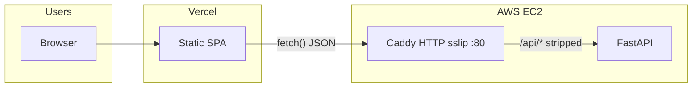

# CI/CD: production deployment (Vercel + EC2)

This document describes **Step 31** GitHub Actions deployment: **push to `main`** updates a **persistent** Terraform-managed EC2 stack, runs **HTTP** smoke on sslip (Caddy uses `deploy/Caddyfile.prod` via `CADDYFILE_SSLIP` until EC2 HTTPS is explicitly re-enabled), builds the **Vercel** frontend with a **configurable** API base URL, and **never** runs `terraform destroy`. **PR ephemeral** behavior is different — see **`docs/EPHEMERAL_CI_ENVIRONMENTS.md`**.

## Main (`deploy-production.yml`) vs PR (`ephemeral-infra-smoke.yml`)

| | **Production (push `main`)** | **Ephemeral (PR / manual)** |
|--|------------------------------|-----------------------------|
| **Terraform state** | Same S3 bucket, fixed key (default `cloud-networking-studio/prod/terraform.tfstate`) | Same bucket, **unique** key per run: `cloud-networking-studio/ephemeral/<run_id>/terraform.tfstate` |
| **Infra lifetime** | **Keeps** VPC/EC2/EIP across runs | **Creates** stack, then **`terraform destroy`** in `always()` |
| **EC2 directory** | `~/cloud-networking-studio` (persistent clone) | `~/cloud-networking-studio-ephemeral` (fresh clone) |
| **Caddy on EC2** | **HTTP :80** on sslip (`CADDYFILE_SSLIP=./deploy/Caddyfile.prod`) | Same pattern |
| **Smoke** | `http://<EIP>.sslip.io` (`stack_base_url_sslip_http`) | Same |
| **Vercel API URL** | Optional secret **`VERCEL_VITE_API_BASE_URL`**; else Terraform **`api_base_url_sslip_http`** | N/A (no Vercel in ephemeral job) |

## Architecture (high level)



- **Vercel** serves the SPA; the browser calls the **EC2** API origin baked into **`VITE_API_BASE_URL`** at build time.
- **EC2 Caddy** (current default in CI) serves **HTTP** on **`http://<EIP>.sslip.io`** with **`deploy/Caddyfile.prod`** mounted through **`docker-compose.sslip.yml`**. Terraform still outputs **`https://…`** URLs for when you turn TLS back on.

## Vercel project settings

| Setting | Value |
|--------|--------|
| Root directory | `frontend` |
| Build command | `npm run build` (CI uses `vercel build` with the same env; see workflow) |
| Output directory | `dist` |
| Production API base (CI) | Set in **`deploy-production.yml`**: optional repository secret **`VERCEL_VITE_API_BASE_URL`** (e.g. `http://203.0.113.7.sslip.io/api`). If unset, defaults to Terraform **`api_base_url_sslip_http`**. |

Example (matches current EC2 HTTP default):

```bash
VITE_API_BASE_URL=http://203.0.113.7.sslip.io/api
```

Copy **`frontend/.env.example`** when developing against a remote API.

## Terraform and durable state

The **Deploy production** workflow (`.github/workflows/deploy-production.yml`) runs **`terraform apply`** on every push to **`main`**. To **reuse** the same EC2/VPC/EIP across runs, Terraform state must live in a **remote backend** (recommended: **S3**).

1. Create an S3 bucket (and optionally a DynamoDB table for state locking).
2. Add repository secret **`TF_STATE_BUCKET`** (required for that workflow).
3. Optional: **`TF_STATE_KEY`** (defaults to `cloud-networking-studio/prod/terraform.tfstate`).
4. Optional: **`TF_STATE_DYNAMODB_TABLE`** for lock coordination.

The repo declares a partial **`backend "s3" {}`** in `infra/terraform/backend.tf` (merged with `versions.tf`). Local developers can use:

- `terraform init -backend-config=backend.local.hcl` (see `backend.s3.hcl.example`), or  
- `terraform init -input=false -reconfigure -backend-config=backend.local.hcl` for a dedicated non-CI state file.

**The production workflow does not run `terraform destroy`.** Destroy is manual or a separate process.

## EC2 bootstrap and `.env`

**GitHub Actions (`deploy-production.yml`):** before SSH deploy, the workflow checks repository secrets **`POSTGRES_PASSWORD`** and **`CNS_CORS_ORIGINS`**. On the instance, if **`~/cloud-networking-studio/.env` does not exist**, the SSH step creates it with a **heredoc** (no secret values in logs). The file includes **`DATABASE_URL`**, **`SSLIP_HOST`**, **`CADDYFILE_SSLIP=./deploy/Caddyfile.prod`**, and **`CNS_CADDY_AUTO_HTTPS=off`** so Caddy stays on **HTTP :80** for the sslip hostname. **`set +x`** is used while secrets are expanded; only **`.env` key names** are printed after write. If **`.env` already exists** (manual install), the workflow **only refreshes `SSLIP_HOST`**.

**`CNS_CORS_ORIGINS`** on the EC2 backend must allow the **Vercel** origin(s) and, for the current HTTP EC2 API, **`http://<EIP>.sslip.io`** (and `https://…` too if you use mixed origins). See `backend/.env.example`.

**`docker-compose.prod.yml`** reads **`POSTGRES_*`**, **`DATABASE_URL`**, **`CNS_*`**, etc. from **`.env`** when you pass **`--env-file .env`** (as the workflow does).

The workflow runs:

```bash
sudo docker compose -f docker-compose.prod.yml -f docker-compose.sslip.yml --env-file .env up -d --build
```

Plain **`docker-compose.prod.yml`** alone remains valid for **HTTP-only** local setups (`deploy/Caddyfile.prod`).

## GitHub Actions: `deploy-production.yml`

On **`push` to `main`** (and **`workflow_dispatch`**), the **`deploy`** job:

1. Runs **backend pytest** (with Postgres service on the runner).
2. Validates **`docker-compose.prod.yml`** via `docker compose config`.
3. Builds the **frontend** once with default Vite env (sanity compile before cloud steps).
4. Runs **Terraform** under **`infra/terraform`**: **`backend.ci.hcl`**, **`terraform init`**, **`fmt -check`**, **`validate`**, **`plan`**, **`apply`**, **`terraform output`** (including HTTP sslip URLs for smoke and Vercel defaults).
5. **Wait for SSH** until **TCP port 22** on **`public_ip`** accepts connections.
6. **Require EC2 deploy secrets:** fails early if **`POSTGRES_PASSWORD`** or **`CNS_CORS_ORIGINS`** are unset.
7. **SSH** (`appleboy/ssh-action`): **`cloud-init`**, **Docker** install if needed, clone/update **`~/cloud-networking-studio`**, **`git checkout`** pushed SHA, **write or refresh `.env`**, **`docker compose … up -d --build`** (with **compose logs** only if config/up fails).
8. **`scripts/prod_smoke_test.sh`** with **`CNS_BASE_URL`** = **`stack_base_url_sslip_http`**.
9. **`vercel pull` / `vercel build` / `vercel deploy --prebuilt --prod`** with **`VITE_API_BASE_URL`** from **`VERCEL_VITE_API_BASE_URL`** or **`api_base_url_sslip_http`**.

**SSH CIDR:** for **local or manual** Terraform, use **`ssh_allowed_cidr = "<MY_PUBLIC_IP>/32"`** in **`terraform.tfvars`**. For **`deploy-production.yml`**, set secret **`TF_VAR_SSH_ALLOWED_CIDR`** appropriately for who may SSH to the instance. **Ephemeral** forces **`0.0.0.0/0`** for GitHub-hosted runners (see **`docs/EPHEMERAL_CI_ENVIRONMENTS.md`**).

`hashicorp/setup-terraform` installs the Terraform CLI with **`terraform_wrapper: false`**.

## CORS

Browsers load the SPA from **Vercel** (`https://*.vercel.app`) but call the **EC2** API on **`http://<EIP>.sslip.io`** (current default) — that is **cross-origin**. FastAPI must allow the **Vercel** origin(s) and the **EC2 API origin** via **`CNS_CORS_ORIGINS`** (and optional **`CNS_CORS_ORIGIN_REGEX`** for previews).

## Required secrets (summary)

| Area | Secret / variable | Purpose |
|------|-------------------|---------|
| AWS | `AWS_ACCESS_KEY_ID`, `AWS_SECRET_ACCESS_KEY` | Terraform + API access |
| AWS | `AWS_REGION` | Region for provider, S3 backend, and `TF_VAR_aws_region` |
| Terraform | `TF_STATE_BUCKET`, optional `TF_STATE_KEY`, `TF_STATE_DYNAMODB_TABLE` | **Production** remote state |
| Terraform | `TF_VAR_KEY_NAME` (workflow maps to env `TF_VAR_key_name`), `TF_VAR_SSH_ALLOWED_CIDR` | EC2 key pair name; SSH ingress CIDR |
| Terraform | Optional `TF_VAR_PROJECT_NAME`, `TF_VAR_ENVIRONMENT` | Default to `cns` and `prod` when unset |
| EC2 (compose on instance) | **`POSTGRES_PASSWORD`**, **`CNS_CORS_ORIGINS`** | Required: create or validate **`.env`** on first deploy (see **EC2 bootstrap**). Include Vercel origins and **`http://<EIP>.sslip.io`** (and `https://…` if used). |
| EC2 | `EC2_SSH_PRIVATE_KEY` | PEM for `appleboy/ssh-action` |
| EC2 | `EC2_SSH_USER` | e.g. `ubuntu` |
| Vercel | `VERCEL_TOKEN`, `VERCEL_ORG_ID`, `VERCEL_PROJECT_ID` | `vercel pull` / `build` / `deploy` |
| Vercel (optional) | **`VERCEL_VITE_API_BASE_URL`** | Overrides **`VITE_API_BASE_URL`** for `vercel build` (e.g. `http://<EIP>.sslip.io/api`). If unset, CI uses Terraform **`api_base_url_sslip_http`**. |

Never commit keys, `terraform.tfvars`, or tokens. Fork PRs do not receive secrets (ephemeral workflow skips them).

See **`docs/EPHEMERAL_CI_ENVIRONMENTS.md`** for PR ephemeral stacks (per-run state, **destroy always**, same HTTP Caddy pattern as production CI today).
