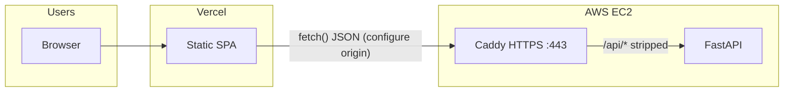

# CI/CD: production deployment (Vercel + EC2)

This document describes **Step 31** GitHub Actions deployment: **push to `main`** updates a **persistent** Terraform-managed EC2 stack, runs **Caddy HTTPS** on the **custom API hostname** (default **`api.cloudnetstudio.com`** via **`deploy/Caddyfile.public-https`**, **`docker-compose.caddy-https.yml`**, **`CADDYFILE_CADDY`**, **`CNS_CADDY_AUTO_HTTPS=on`**, **`CNS_CADDY_SITE_ADDRESS`**, volumes **`caddy_data`/`caddy_config`**), merges required **CORS** origins on the instance, runs **`prod_smoke_test.sh`** against **`https://<API host>`** with **`CNS_SMOKE_API_ONLY=1`** (no **`-L`**; smoke waits **`/api/health`** only because the SPA is on **Vercel**), verifies **HTTP** (with **`-L`** to follow redirect) and **HTTPS** **`/api/health`**, builds the **Vercel** app with **`VITE_API_BASE_URL=https://<API host>/api`** (unless **`VERCEL_VITE_API_BASE_URL`** is set), and **never** runs `terraform destroy`. Override the API hostname with repository **Variable** **`CNS_PRODUCTION_API_HOST`**. **PR ephemeral** stays **HTTP-only** on sslip — see **`docs/EPHEMERAL_CI_ENVIRONMENTS.md`**.

## Main (`deploy-production.yml`) vs PR (`ephemeral-infra-smoke.yml`) vs staging (`deploy-staging.yml`)

| | **Production (manual)** | **Staging (manual, any branch)** | **Ephemeral (PR / manual)** |
|--|-------------------------|----------------------------------|-----------------------------|
| **Workflow** | `deploy-production.yml` | `deploy-staging.yml` | `ephemeral-infra-smoke.yml` |
| **Terraform state** | Fixed prod key | Optional staging key (`…/staging/terraform.tfstate`) | Unique per run, **destroyed** |
| **Infra lifetime** | **Keeps** EC2/RDS | **Keeps** staging EC2 (if Terraform enabled) | **Temporary** |
| **EC2 directory** | `~/cloud-networking-studio` | `~/cloud-networking-studio-staging` | `~/cloud-networking-studio-ephemeral` |
| **Compose project** | `cns-prod` | `cns-staging` | `cns-prod` (ephemeral name from compose file) |
| **API host** | `api.cloudnetstudio.com` | `api-staging.cloudnetstudio.com` | `<EIP>.sslip.io` |
| **Environment** | `production` | `staging` | `production` (HTTP lab stack) |

See **[STAGING_DEPLOYMENT.md](./STAGING_DEPLOYMENT.md)** for staging setup and safety rules.

## Main (`deploy-production.yml`) vs PR (`ephemeral-infra-smoke.yml`) — detail

| | **Production (manual)** | **Ephemeral (PR / manual)** |
|--|-------------------------|-----------------------------|
| **Terraform state** | Same S3 bucket, fixed key (default `cloud-networking-studio/prod/terraform.tfstate`) | Same bucket, **unique** key per run: `cloud-networking-studio/ephemeral/<run_id>/terraform.tfstate` |
| **Infra lifetime** | **Keeps** VPC/EC2/EIP across runs | **Creates** stack, then **`terraform destroy`** in `always()` |
| **EC2 directory** | `~/cloud-networking-studio` (persistent clone) | `~/cloud-networking-studio-ephemeral` (fresh clone) |
| **Caddy on EC2** | **HTTPS** on **`api.<domain>`** (`CADDYFILE_CADDY=./deploy/Caddyfile.public-https`, **`CNS_CADDY_AUTO_HTTPS=on`**, **`CNS_CADDY_SITE_ADDRESS`**, **`SSLIP_HOST`/`CNS_SSLIP_HOST`** same hostname for legacy compose keys, volumes **`caddy_data`/`caddy_config`**) | **HTTP :80** on sslip (`CADDYFILE_SSLIP=./deploy/Caddyfile.prod`, **`CNS_CADDY_AUTO_HTTPS=off`**, **`CNS_CADDY_SITE_ADDRESS=:80`**) |
| **Smoke** | **`https://<API host>`** + **`CNS_SMOKE_API_ONLY=1`** (default **`https://api.cloudnetstudio.com`**) — **`GET /api/health`** only; no **`-L`** | **`http://<EIP>.sslip.io`** (`stack_base_url_sslip_http`) — **`GET /`** + **`GET /api/health`** |
| **Verify** | **`curl -vL`** **`http://<API host>/api/health`** (follow redirect); retries + **`curl -vk`** **`https://<API host>/api/health`** | N/A |
| **Vercel API URL** | Optional **`VERCEL_VITE_API_BASE_URL`**; else **`https://<API host>/api`** (same default as **`CNS_PRODUCTION_API_HOST`**) | N/A |

## Architecture (high level)



- **Vercel** serves the SPA; the browser calls the **EC2** API origin baked into **`VITE_API_BASE_URL`** at build time (production CI defaults to **`https://api.cloudnetstudio.com/api`** unless **`VERCEL_VITE_API_BASE_URL`** or **`CNS_PRODUCTION_API_HOST`** overrides it).
- **EC2 Caddy** terminates **TLS** for **`https://<API host>`** using **`deploy/Caddyfile.public-https`**; **Let's Encrypt** state lives in Compose volumes **`caddy_data`** and **`caddy_config`**. The security group allows **TCP 22 / 80 / 443** (**80** and **443** are **`0.0.0.0/0`** for the web). **`docker-compose.caddy-https.yml`** publishes **`80:80`** and **`443:443`**. After each successful **`docker compose up`**, the workflow prints **`docker volume ls | grep caddy`**, **`docker compose ps`**, and **`docker compose … logs caddy --tail=80`** from the instance for debugging.

**Never delete `caddy_data` or `caddy_config` in production** (for example with **`docker compose down -v`**, **`docker volume rm …`**, or pruning those volumes). Removing them makes Caddy request new Let's Encrypt certificates and can exhaust **Let's Encrypt rate limits**. The production deploy script refuses **`down -v`** when **`CNS_CADDY_AUTO_HTTPS=on`**. If you must reset **only** bundled Postgres data, remove the **`postgres_data`** volume by name (see **`docker volume ls`**) instead of wiping the whole project with **`-v`**.

## Vercel project settings

In the **Vercel dashboard** (Project → Settings → General), align with **`deploy-production.yml`**:

| Setting | Value |
|--------|--------|
| **Root Directory** | **`frontend`** — Vercel resolves the app from `frontend/`; CI must **not** `cd frontend` before **`vercel deploy`** (that double-paths to `frontend/frontend`). |

**Vercel → Settings → Environment variables (production):** set **`VITE_API_BASE_URL`** to **`https://api.cloudnetstudio.com/api`** (CI also injects this during **`npm run build --prefix frontend`** when **`VERCEL_VITE_API_BASE_URL`** is unset).

**Why:** CI builds from the **repository root** and deploys with **`vercel deploy`** from the same directory:

```bash
npm ci --prefix frontend
npx vercel@54.0.0 pull --yes --environment=production --token "$VERCEL_TOKEN"
VITE_API_BASE_URL=https://api.cloudnetstudio.com/api npm run build --prefix frontend
npx vercel@54.0.0 deploy --prod --yes --token "$VERCEL_TOKEN"
```

Do **not** `cd frontend` before **`vercel deploy`**, and do **not** pass **`frontend/dist`**, **`./dist`**, or **`--cwd frontend/dist`** — those break path resolution when **Root Directory** is **`frontend`**.

CI runs **`vercel pull`** inside **`frontend/`** for project linking (`.vercel` next to the app). It does **not** run **`vercel build`** (no Vercel remote build) and does **not** use **`--prebuilt`**.

**Production API base (CI):** Optional repository secret **`VERCEL_VITE_API_BASE_URL`**. If unset, CI uses **`https://<API host>/api`** (from **`CNS_PRODUCTION_API_HOST`**, default **`api.cloudnetstudio.com`**) for the local **`npm run build`**.

Example override:

```bash
VERCEL_VITE_API_BASE_URL=https://api.example.com/api
```

Copy **`frontend/.env.example`** when developing against a remote API.

## Cloudflare DNS (example: cloudnetstudio.com)

For **split hosting** (Vercel UI + EC2 API), use **DNS only** (grey cloud) so **Vercel** and **EC2** terminate TLS themselves — do not proxy **`app`** or **`api`** through Cloudflare orange-cloud for this template unless you configure Cloudflare SSL modes and origin rules separately.

| Record | Type | Name | Target / value | Proxy |
|--------|------|------|------------------|--------|
| API | **A** | `api` | EC2 **Elastic IP** (Terraform **`public_ip`**) | **DNS only** |
| App | **CNAME** | `app` | Your **Vercel** target (e.g. **`cname.vercel-dns.com`**) | **DNS only** |

After DNS propagates, **`curl -vk https://api.<your-domain>/api/health`** should return **HTTP/2 200** once Caddy has obtained a certificate.

## Terraform and durable state

The **Deploy production** workflow (`.github/workflows/deploy-production.yml`) runs **`terraform apply`** on every push to **`main`**. To **reuse** the same EC2/VPC/EIP across runs, Terraform state must live in a **remote backend** (recommended: **S3**).

1. Create an S3 bucket (and optionally a DynamoDB table for state locking).
2. Add repository secret **`TF_STATE_BUCKET`** (required for that workflow).
3. Optional: **`TF_STATE_KEY`** (defaults to `cloud-networking-studio/prod/terraform.tfstate`).
4. Optional: **`TF_STATE_DYNAMODB_TABLE`** for lock coordination.

The repo declares a partial **`backend "s3" {}`** in `infra/terraform/backend.tf` (merged with `versions.tf`). Local developers can use:

- `terraform init -backend-config=backend.local.hcl` (see `backend.s3.hcl.example`), or  
- `terraform init -input=false -reconfigure -backend-config=backend.local.hcl` for a dedicated non-CI state file.

**The production workflow does not run `terraform destroy`.** Destroy is manual or a separate process.

## EC2 bootstrap and `.env`

**GitHub Actions (`deploy-production.yml`):** before **Terraform apply**, the workflow checks repository secrets **`RDS_PASSWORD` or `POSTGRES_PASSWORD`** (either satisfies the DB secret requirement) and **`CNS_CORS_ORIGINS`**. On the instance, the SSH step **writes** **`~/cloud-networking-studio/.env`** from secrets and Terraform outputs (no secret values in logs). Production sets **`CNS_CADDY_SITE_ADDRESS`**, **`SSLIP_HOST`**, **`CNS_SSLIP_HOST`** to the same public API hostname (default **`api.cloudnetstudio.com`**; override with repository **Variable** **`CNS_PRODUCTION_API_HOST`**), **`CADDYFILE_CADDY=./deploy/Caddyfile.public-https`**, **`CNS_CADDY_AUTO_HTTPS=on`**, appends required **`CNS_CORS_ORIGINS`** entries (app + API + legacy sslip HTTP), **`DATABASE_URL`**, a strong **`AUTH_SECRET_KEY`** (from GitHub secret **`AUTH_SECRET_KEY`**, existing **`.env`**, or freshly generated — Step 53D rejects the compose dev default), and related **`CNS_*`** keys. **`set +x`** is used while secrets are expanded; only **`.env` key names** are printed after write.

**HTTPS deploy:** **`CNS_CADDY_SITE_ADDRESS`** defaults to **`api.cloudnetstudio.com`** (override with repository **Variable** **`CNS_PRODUCTION_API_HOST`**). The SSH step sets **`CNS_CADDY_AUTO_HTTPS=on`**. The script runs **`docker compose … down`** without **`-v`**, then **`up -d --build --remove-orphans`**, so **`caddy_data`** / **`caddy_config`** and **`postgres_data`** survive deploys.

**`CNS_CORS_ORIGINS`** on the EC2 backend must allow the **Vercel** app origin (**`https://app.cloudnetstudio.com`**) and the **API** origins (**`http://`/`https://api.cloudnetstudio.com`**). The deploy script appends a fixed set including **`http://<ElasticIP>.sslip.io`** for break-glass HTTP access; add any other origins in the **`CNS_CORS_ORIGINS`** secret. See `backend/.env.example`.

**Optional AWS RDS:** set repository variable **`RDS_ENABLED=true`** so **`terraform apply`** passes **`TF_VAR_rds_enabled=true`**. Terraform outputs **`rds_address`**, **`rds_port`**, **`rds_database_name`**, and **`rds_username`** (never the password). The SSH deploy step sets **`DATABASE_URL`** to **RDS** when those outputs are present; the Compose **`postgres`** service may still start on the instance but the API uses **`DATABASE_URL`**. See **`docs/RDS.md`**.

**`docker-compose.prod.yml`** reads **`POSTGRES_*`**, **`DATABASE_URL`**, **`CNS_*`**, etc. from **`.env`** when you pass **`--env-file .env`** (as the workflow does).

### GCP infrastructure deployment credentials (production)

Production **Infrastructure Deployments** (GCP Terraform + remote Docker SSH) require three host files under **`/opt/cns/secrets/`**, mounted read-only into **backend** and **runner**:

| Variable | Default path | Purpose |
|----------|--------------|---------|
| **`GOOGLE_APPLICATION_CREDENTIALS`** | `/opt/cns/secrets/gcp-terraform-sa.json` | GCP service account JSON for Terraform |
| **`CNS_REMOTE_DOCKER_SSH_KEY_PATH`** | `/opt/cns/secrets/gcp-remote-docker-key` | Private SSH key for runtime targets |
| **`CNS_REMOTE_DOCKER_SSH_PUBLIC_KEY_PATH`** | `/opt/cns/secrets/gcp-remote-docker-key.pub` | Public key injected into VM metadata |

**First-time setup on the EC2 host:** place the three files on disk (mode **`0600`** for private keys, **`0644`** for public key and JSON). The deploy script creates **`/opt/cns/secrets`** if missing but does **not** upload secret contents from GitHub.

**Every production deploy** runs **`scripts/prod_deploy_remote.sh`**, which:

1. Merges credential paths into **`~/cloud-networking-studio/.env`** (preserves existing non-empty values from the previous **`.env`**).
2. Verifies each host file exists and is readable **before** `docker compose up`.
3. Verifies **backend** and **runner** containers see the env vars and can read the mounted files **after** recreate.

Override paths with repository **Variables** **`CNS_PRODUCTION_GCP_TERRAFORM_CREDS_PATH`**, **`CNS_REMOTE_DOCKER_SSH_KEY_PATH`**, **`CNS_REMOTE_DOCKER_SSH_PUBLIC_KEY_PATH`** (same as staging). Deploy **fails with a clear error** if any required file is missing.

See also **`docs/EXTERNAL_INFRA_DEPLOYMENT.md`** and **`docs/INFRASTRUCTURE_DEPLOYMENTS.md`**.

**Bundled Postgres** starts with the rest of the stack (no Compose profile). Example on the instance:

```bash
sudo docker compose -f docker-compose.prod.yml -f docker-compose.caddy-https.yml --env-file .env up -d --build --remove-orphans
```

Plain **`docker-compose.prod.yml`** is valid for **HTTP-only** local setups (`deploy/Caddyfile.prod`). Host port **5433** maps to Postgres for **`pytest`** on your laptop (see [docs/testing.md](testing.md)).

## GitHub Actions: `deploy-production.yml`

On **`push` to `main`** (and **`workflow_dispatch`**), the **`deploy`** job:

1. Runs **backend pytest** (with Postgres service on the runner).
2. Validates **`docker-compose.prod.yml`** and **`docker-compose.prod.yml` + `docker-compose.caddy-https.yml`** via `docker compose config --quiet` (dummy **`CNS_CADDY_SITE_ADDRESS`** / **`SSLIP_HOST`** / **`CNS_SSLIP_HOST`** for the merge check).
3. **Set production API host** (default **`api.cloudnetstudio.com`**; repository **Variable** **`CNS_PRODUCTION_API_HOST`**).
4. **Require EC2 deploy secrets:** fails early if **`CNS_CORS_ORIGINS`** is unset or if both **`RDS_PASSWORD`** and **`POSTGRES_PASSWORD`** are unset (either DB secret alone is enough).
5. Sets up **Node.js 20** (for the Vercel deploy step).
6. Runs **Terraform** under **`infra/terraform`**: **`backend.ci.hcl`**, **`terraform init`**, **`fmt -check`**, **`validate`**, **`plan`**, **`apply`**, **`terraform output`** (including **`public_ip`**, sslip URLs for reference, and optional **`rds_*`** fields when **`RDS_ENABLED`** is true). When **`RDS_ENABLED`**, **`TF_VAR_rds_master_password`** is taken from **`RDS_PASSWORD`** or **`POSTGRES_PASSWORD`**.
7. **Wait for SSH** until **TCP port 22** on **`public_ip`** accepts connections.
8. **SSH** (`appleboy/ssh-action`): **`cloud-init`**, **Docker** install if needed, runs **`scripts/prod_deploy_remote.sh`** (clone/update **`~/cloud-networking-studio`**, **`git checkout`** pushed SHA, **write `.env`** with infra credential paths, validate host files + container env, **`docker compose … down`** (no **`-v`**), **`docker compose … up -d --build --remove-orphans`**, force-recreate **backend/runner**, then **`docker volume ls | grep caddy`**, **`docker compose ps`**, **`docker compose … logs caddy --tail=80`** (full-stack compose logs only if config/up fails).
9. **`scripts/prod_smoke_test.sh`** with **`CNS_BASE_URL`** = **`https://<API host>`** and **`CNS_SMOKE_API_ONLY=1`** (no **`-L`**): waits for **`GET /api/health`** only (SPA is on Vercel, not the API host). After **Step 34** the script authenticates (register/login), uses **Bearer** tokens for topology APIs, and expects **401** for unauthenticated topology **POST** when **`AUTH_REQUIRE_LOGIN=true`** (set in the workflow-written **`.env`**).
10. **`curl -vL`** **`http://<API host>/api/health`** on the runner (follow redirect to HTTPS).
11. Retries **`curl -sfS`** on **`https://<API host>/api/health`**; on failure prints **`curl -vk`** for TLS debugging.
12. **Vercel:** from **repo root**, **`npm ci --prefix frontend`**, **`vercel pull`**, **`VITE_API_BASE_URL=… npm run build --prefix frontend`**, then **`vercel deploy --prod --yes`** (no **`cd frontend`**, no **`frontend/dist`** path).

**SSH CIDR:** for **local or manual** Terraform, use **`ssh_allowed_cidr = "<MY_PUBLIC_IP>/32"`** in **`terraform.tfvars`**. For **`deploy-production.yml`**, set secret **`TF_VAR_SSH_ALLOWED_CIDR`** appropriately for who may SSH to the instance. **Ephemeral** forces **`0.0.0.0/0`** for GitHub-hosted runners (see **`docs/EPHEMERAL_CI_ENVIRONMENTS.md`**).

`hashicorp/setup-terraform` installs the Terraform CLI with **`terraform_wrapper: false`**.

## CORS

Browsers load the SPA from **Vercel** (e.g. **`https://app.cloudnetstudio.com`**) but call the **EC2** API on **`https://api.cloudnetstudio.com`** (default) — that is **cross-origin**. FastAPI must allow those origins (and any preview URLs) via **`CNS_CORS_ORIGINS`** (and optional **`CNS_CORS_ORIGIN_REGEX`**). The deploy script appends a baseline set on the instance; extend with the **`CNS_CORS_ORIGINS`** secret as needed.

## Required secrets (summary)

| Area | Secret / variable | Purpose |
|------|-------------------|---------|
| AWS | `AWS_ACCESS_KEY_ID`, `AWS_SECRET_ACCESS_KEY` | Terraform + API access |
| AWS | `AWS_REGION` | Region for provider, S3 backend, and `TF_VAR_aws_region` |
| Terraform | `TF_STATE_BUCKET`, optional `TF_STATE_KEY`, `TF_STATE_DYNAMODB_TABLE` | **Production** remote state |
| Terraform | `TF_VAR_KEY_NAME` (workflow maps to env `TF_VAR_key_name`), `TF_VAR_SSH_ALLOWED_CIDR` | EC2 key pair name; SSH ingress CIDR |
| Terraform | Optional `TF_VAR_PROJECT_NAME`, `TF_VAR_ENVIRONMENT` | Default to `cns` and `prod` when unset |
| Terraform | Optional repository variable **`RDS_ENABLED`** (`true` / unset) | When **`true`**, sets **`TF_VAR_rds_enabled=true`** for optional **RDS PostgreSQL** (see **`docs/RDS.md`**) |
| GitHub **Variables** | **`CNS_PRODUCTION_API_HOST`** (optional) | Overrides default **`api.cloudnetstudio.com`** for Caddy, smoke **`CNS_BASE_URL`**, and CI **`VITE_API_BASE_URL`** default. |
| EC2 (compose on instance) | **`RDS_PASSWORD`** or **`POSTGRES_PASSWORD`**, **`CNS_CORS_ORIGINS`**; optional **`AUTH_SECRET_KEY`** | **`.env`** on each deploy: DB password for Compose **`postgres`** or for **RDS** + **`DATABASE_URL`**; merge with required app/API/sslip origins (see **CORS** above). **`AUTH_SECRET_KEY`**: use repo secret if set, else preserve existing **`.env`**, else generate (required for Step 53D production startup). |
| EC2 | `EC2_SSH_PRIVATE_KEY` | PEM for `appleboy/ssh-action` |
| EC2 | `EC2_SSH_USER` | e.g. `ubuntu` |
| Vercel | `VERCEL_TOKEN`, `VERCEL_ORG_ID`, `VERCEL_PROJECT_ID` | **`vercel pull`** + **`vercel deploy`** from **repo root**; Vercel **Root Directory** = **`frontend`** |
| Vercel (optional) | **`VERCEL_VITE_API_BASE_URL`** | Overrides **`VITE_API_BASE_URL`** for the **local** **`npm run build`** in **`frontend/`**. If unset, CI uses **`https://<API host>/api`** (default **`https://api.cloudnetstudio.com/api`**). |

Never commit keys, `terraform.tfvars`, or tokens. Fork PRs do not receive secrets (ephemeral workflow skips them).

See **`docs/EPHEMERAL_CI_ENVIRONMENTS.md`** for PR ephemeral stacks (per-run state, **destroy always**, **HTTP-only** Caddy on sslip for CI smoke).
