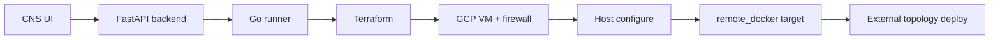

# External Infrastructure Deployment (GCP Release Candidate — Step 57F)

Cloud Networking Studio can provision **GCP Docker-ready VMs** via Terraform, configure them for remote Docker workloads, register a **runtime target**, and deploy topology workloads externally — all auditable from the UI.

> **Scope (57F):** GCP `docker-vm` only. AWS and other providers are not enabled for real apply.

## Architecture flow



1. **Create** infrastructure deployment (`gcp` + `docker-vm`)
2. **Validate** → Terraform init/validate/fmt
3. **Plan** → Terraform plan (stored in persistent workspace)
4. **Confirm apply** (typed `APPLY`) → Terraform apply from stored plan
5. **Configure** → Ansible installs Docker, creates `/opt/cns-external-deployments`
6. **Register** → CNS creates linked `remote_docker` runtime target
7. **External deploy** → Validate/plan/apply topology to generated target
8. **Destroy workload** → External deployment destroy (remote `docker compose down`)
9. **Destroy infra** (typed `DESTROY`) → Terraform destroy + deactivate target

## Required GCP setup

### Service account (testing)

Use a dedicated service account JSON mounted on the server. For staging/testing, these roles are sufficient:

| Role | Purpose |
|------|---------|
| **Compute Admin** | Create/delete VM, firewall rules |
| **Service Account User** | Attach service account to VM |

A least-privilege custom role can replace these later.

### Network

- Default VPC (`network_name=default`) works for staging
- Or create a dedicated VPC and set `network_name` to a `cns-*` prefixed name

### SSH keys

CNS injects the platform public key into instance metadata (`enable-oslogin=FALSE`). Generate a matching key pair on the server:

```bash
ssh-keygen -t ed25519 -f /opt/cns/secrets/gcp-remote-docker-key -N "" -C cns-remote-docker
chmod 600 /opt/cns/secrets/gcp-remote-docker-key
chmod 644 /opt/cns/secrets/gcp-remote-docker-key.pub
```

## Required server configuration

### Environment variables

| Variable | Example | Used by |
|----------|---------|---------|
| `GOOGLE_APPLICATION_CREDENTIALS` | `/opt/cns/secrets/gcp-terraform-sa.json` | Terraform (backend/runner) |
| `CNS_REMOTE_DOCKER_SSH_KEY_PATH` | `/opt/cns/secrets/gcp-remote-docker-key` | Runtime target SSH (private) |
| `CNS_REMOTE_DOCKER_SSH_PUBLIC_KEY_PATH` | `/opt/cns/secrets/gcp-remote-docker-key.pub` | Terraform metadata (public) |

Create deployment with:

```json
"credentials_ref": "env:GOOGLE_APPLICATION_CREDENTIALS"
```

### Secret mounts (Compose)

```yaml
volumes:
  - /opt/cns/secrets:/opt/cns/secrets:ro
  - /opt/cns/infra-workspaces:/opt/cns/infra-workspaces   # runner only
```

See `docker-compose.prod.yml` and `docker-compose.staging.yml`.

## UI test flow (staging smoke)

Run `./scripts/staging_gcp_external_infra_smoke.sh` for a printable checklist, or follow manually:

1. **Infrastructure** panel → Create GCP `docker-vm` deployment
2. **Validate** → status `validated`
3. **Plan** → status `awaiting_confirmation`; review safety checklist
4. **Confirm apply** → type `APPLY`
5. Verify outputs: `public_ip`, `private_ip`, `ssh_user`, `instance_name`
6. Verify status `succeeded` and linked runtime target appears
7. **External Deployments** → select generated target → Validate target
8. Deploy a small topology (plan → apply)
9. Verify remote containers (`docker ps` on VM or CNS logs)
10. **Destroy** external workload
11. **Destroy infrastructure** → type `DESTROY`
12. Verify deployment `destroyed`; target inactive; VM removed in GCP console

## Deployment statuses (57F)

| Status | Meaning | Recovery |
|--------|---------|----------|
| `awaiting_confirmation` | Plan ready | Confirm apply |
| `succeeded` | Apply + configure + target OK | Destroy infra |
| `configuration_failed` | Apply OK, host configure failed | **Retry configuration** or Destroy |
| `registration_failed` | Apply + configure OK, no runtime target | **Retry configuration** or Destroy |
| `failed` | Validate/plan/apply error | Re-validate or Destroy if applied |
| `destroyed` | Resources cleaned up | — |

Destroy is **idempotent**: repeated destroy returns `destroyed` without 500.

## Troubleshooting

| Symptom | Cause | Fix |
|---------|-------|-----|
| `Terraform credentials_ref is not configured` | Missing GCP SA env | Set `GOOGLE_APPLICATION_CREDENTIALS`; mount secrets |
| `CNS remote Docker SSH public key is not configured` | Missing `.pub` file | Generate key pair; set `CNS_REMOTE_DOCKER_SSH_PUBLIC_KEY_PATH` |
| SSH permission denied on target | OS Login enabled on old VM, or key mismatch | Destroy and re-apply with current template; verify key pair |
| `docker: command not found` / exit 127 | Configure failed or incomplete | Retry configuration; check Ansible logs |
| Firewall permission denied | SA lacks Compute Admin | Grant role; re-plan |
| `network ... not found` | Invalid `network_name` | Use `default` or existing VPC |
| Plan stale | Variables changed after plan | Re-run Plan |
| Partial apply / `configuration_failed` | SSH or Ansible issue after VM created | Retry configuration or Destroy infra |
| Runner 422 on apply | Missing stored `tfplan` | Ensure `/opt/cns/infra-workspaces` mounted on runner |

## Cleanup

**External workload only:**

- External Deployments panel → Destroy on the deployment job

**Full stack:**

1. Destroy external workload first (recommended)
2. Infrastructure panel → Destroy infrastructure (type `DESTROY`)
3. Verify GCP console: VM and firewall rules removed
4. Repeated destroy is safe (no-op when already `destroyed`)

**Emergency (GCP console):** Delete compute instance and firewall rules prefixed with your `instance_name` / `cns-`.

## Related docs

- [INFRASTRUCTURE_DEPLOYMENTS.md](./INFRASTRUCTURE_DEPLOYMENTS.md) — Terraform safety gates (57D–57E)
- [EXTERNAL_DEPLOYMENTS.md](./EXTERNAL_DEPLOYMENTS.md) — remote_docker workload deploy
