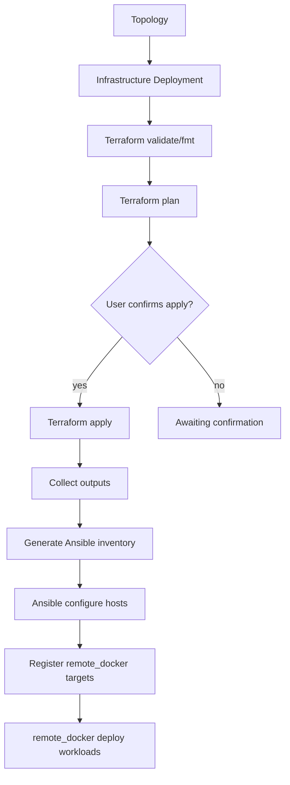

# Infrastructure Deployments (Step 57C / 57D)

Cloud Networking Studio orchestrates **Terraform provisioning**, **Ansible host configuration**, and **remote_docker workload deployment** as separate, auditable platform stages.

> **Not Kubernetes orchestration.** This step prepares runtime hosts. Kubernetes support comes later.

## Step 57D: Real Terraform validate + plan (GCP)

57D adds **real Terraform validate and plan** for cloud providers while **apply remains disabled** for real cloud deployments. No cloud resources are created in this step.

| Capability | local/mock | GCP `docker-vm` | AWS `docker-vm` |
|------------|------------|-----------------|-----------------|
| `terraform init -backend=false` | mock or real | real | coming soon |
| `terraform validate` | yes | yes | — |
| `terraform plan` | yes | yes | — |
| `terraform apply` | mock in-process | **409 disabled** | — |
| Destroy | mock after apply | plan-only → **409 disabled** | — |

Templates live under:

```
infra_templates/terraform/gcp/docker_vm/
  main.tf
  variables.tf
  outputs.tf
```

The registry maps `docker-vm` + `gcp` → `terraform/gcp/docker_vm` via `provider_terraform_dirs`.

### GCP credentials_ref

Never store raw credentials in the database. Pass a server-side pointer:

| credentials_ref | Server env var | Notes |
|-----------------|----------------|-------|
| `env:GOOGLE_APPLICATION_CREDENTIALS` | path to service account JSON | mount file read-only in backend/runner |
| `env:GOOGLE_CREDENTIALS_JSON` | inline JSON | validated but never logged |

Example compose/backend env:

```bash
GOOGLE_APPLICATION_CREDENTIALS=/opt/cns/secrets/gcp-sa.json
```

Create deployment with `"credentials_ref": "env:GOOGLE_APPLICATION_CREDENTIALS"`.

If missing: `Terraform credentials_ref is not configured on the server.`

### Plan-only safety

- Real cloud apply returns **409**: `Real cloud apply is disabled in this version.`
- Destroy without apply returns **409**: `Nothing to destroy: plan-only deployment.`
- local-mock confirm/apply/configure flow is unchanged.

### Terraform → future runtime targets

GCP template outputs (`hosts`, `exposed_ports`, `zone`) map to future `remote_docker` target registration after apply is enabled. 57D persists plan summaries and outputs metadata only.

## Architecture



### Execution path

```
FastAPI backend  →  Go runner POST /infra/executions  →  terraform | ansible-playbook
```

- Isolated temp workspaces under `/tmp/cns-infra/{execution_id}`
- Whitelisted templates in `infra_templates/`
- Whitelisted playbooks in `ansible_playbooks/`
- No arbitrary module/playbook uploads
- Secrets redacted in persisted logs

## Stack components

| Layer | Responsibility |
|-------|----------------|
| **Terraform** | Provision VMs, networks, security groups, SSH access |
| **Ansible** | Install Docker, Compose, CNS runtime directories |
| **remote_docker** | Deploy topology containers to prepared hosts |

## Supported templates (initial)

| Template | Providers | Description |
|----------|-----------|-------------|
| `local-mock` | local, mock | Deterministic mock outputs for dev/CI |
| `gcp-vm` | gcp | GCP VM module composition |
| `aws-ec2` | aws | AWS EC2 module composition |
| `docker-vm` | local, mock, gcp, aws | Docker-ready VM stack |

Modules under `infra_templates/modules/`:

- `generic-vm`, `docker-vm`, `vpc-network`, `security-group`, `ssh-access`

## Deployment statuses

`pending` → `validating` → `validated` → `planning` → `awaiting_confirmation` → `applying` → `configuring` → `succeeded`

Destroy: `destroying` → `destroyed` (real cloud: only after a successful apply in a future release)

## API

| Method | Path | Description |
|--------|------|-------------|
| GET | `/infrastructure/templates` | List whitelisted templates |
| GET | `/topologies/{id}/infrastructure-deployments` | List deployments |
| POST | `/topologies/{id}/infrastructure-deployments` | Create deployment (`credentials_ref` for cloud) |
| POST | `/infrastructure-deployments/{id}/validate` | Terraform init + fmt + validate |
| POST | `/infrastructure-deployments/{id}/plan` | Terraform plan (requires `validated`) |
| GET | `/infrastructure-deployments/{id}` | Deployment detail |
| GET | `/infrastructure-deployments/{id}/executions` | Execution logs/artifacts |
| POST | `/infrastructure-deployments/{id}/confirm` | User approval gate → apply + ansible (409 for real cloud in 57D) |
| POST | `/infrastructure-deployments/{id}/destroy` | Terraform destroy (409 for plan-only cloud) |

## Confirmation gate

Terraform **apply** never runs automatically after plan. The UI shows:

- VM count
- Region/zone
- Exposed ports
- Host preview / public IPs

The user must POST `/confirm` with `{ "confirm": true }`.

## Security restrictions

- Template/playbook allowlists only (`infra_templates/registry.json`)
- Per-template variable allowlists (unknown keys rejected)
- Variable keys sanitized (no secrets in `variables_json`; use `credentials_ref`)
- CIDR, region, zone, and machine type validation for GCP
- Path traversal rejected
- No arbitrary module upload, remote modules, custom provisioners, or backend config
- Terraform state contents are **not** exposed via API — only metadata (`state_metadata_json`)
- Local backend only (`-backend=false`); remote backends planned

## Troubleshooting (57D)

| Symptom | Cause | Fix |
|---------|-------|-----|
| `Terraform CLI is not installed in runner image` | runner image missing terraform | rebuild runner (`runner/Dockerfile` installs terraform) |
| `Terraform credentials_ref is not configured on the server` | missing env var or file | set `GOOGLE_APPLICATION_CREDENTIALS` or `GOOGLE_CREDENTIALS_JSON` on backend |
| `terraform init failed` | provider plugin download/auth | check network; verify service account has minimal read roles for plan |
| `terraform plan failed` | invalid variables or missing VPC | review plan logs in executions; confirm `network_name` exists |
| Apply button disabled (GCP) | intentional 57D guard | wait for apply enablement in a later step |

## Observability

Each deployment stores:

- **Event timeline** (`events_json`): validate started, plan completed, apply started, runtime ready, …
- **Metrics** (`metrics_json`): plan/apply/ansible durations, success/failure counters

Runner records infra operations in `/runtime/operations/recent`.

## Provider matrix

| Provider | Terraform | Ansible | Notes |
|----------|-----------|---------|-------|
| local/mock | mock executor | mock/local | Default for dev & CI |
| gcp | **real validate/plan** (57D) | after future apply | `credentials_ref` env pointers |
| aws | coming soon (docker-vm) | after future apply | stub rejected at create |

## Future: Kubernetes

After hosts are prepared and workloads run via `remote_docker`, Kubernetes orchestration will add:

- Cluster provisioning templates
- CNI/storage class configuration
- In-cluster runner targets

See `docs/ROADMAP.md`.

## Related docs

- [EXTERNAL_DEPLOYMENTS.md](./EXTERNAL_DEPLOYMENTS.md) — remote_docker validate/plan/apply
- [STAGING_DEPLOYMENT.md](./STAGING_DEPLOYMENT.md) — platform hosting (separate from user infra stacks)
