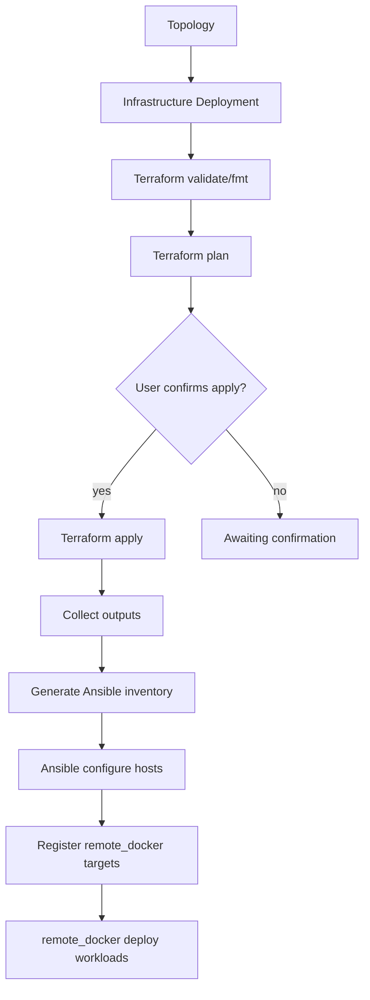

# Infrastructure Deployments (Step 57C)

Cloud Networking Studio orchestrates **Terraform provisioning**, **Ansible host configuration**, and **remote_docker workload deployment** as separate, auditable platform stages.

> **Not Kubernetes orchestration.** This step prepares runtime hosts. Kubernetes support comes later.

## Architecture



### Execution path

```
FastAPI backend  →  Go runner POST /infra/executions  →  terraform | ansible-playbook
```

- Isolated temp workspaces under `/tmp/cns-infra/{execution_id}`
- Whitelisted templates in `infra_templates/`
- Whitelisted playbooks in `ansible_playbooks/`
- No arbitrary module/playbook uploads
- Secrets redacted in persisted logs

## Stack components

| Layer | Responsibility |
|-------|----------------|
| **Terraform** | Provision VMs, networks, security groups, SSH access |
| **Ansible** | Install Docker, Compose, CNS runtime directories |
| **remote_docker** | Deploy topology containers to prepared hosts |

## Supported templates (initial)

| Template | Providers | Description |
|----------|-----------|-------------|
| `local-mock` | local, mock | Deterministic mock outputs for dev/CI |
| `gcp-vm` | gcp | GCP VM module composition |
| `aws-ec2` | aws | AWS EC2 module composition |
| `docker-vm` | local, mock, gcp, aws | Docker-ready VM stack |

Modules under `infra_templates/modules/`:

- `generic-vm`, `docker-vm`, `vpc-network`, `security-group`, `ssh-access`

## Deployment statuses

`pending` → `validating` → `planning` → `awaiting_confirmation` → `applying` → `configuring` → `succeeded`

Destroy: `destroying` → `destroyed`

## API

| Method | Path | Description |
|--------|------|-------------|
| GET | `/infrastructure/templates` | List whitelisted templates |
| GET | `/topologies/{id}/infrastructure-deployments` | List deployments |
| POST | `/topologies/{id}/infrastructure-deployments` | Create + validate + plan |
| GET | `/infrastructure-deployments/{id}` | Deployment detail |
| GET | `/infrastructure-deployments/{id}/executions` | Execution logs/artifacts |
| POST | `/infrastructure-deployments/{id}/confirm` | User approval gate → apply + ansible |
| POST | `/infrastructure-deployments/{id}/destroy` | Terraform destroy + cleanup |

## Confirmation gate

Terraform **apply** never runs automatically after plan. The UI shows:

- VM count
- Region/zone
- Exposed ports
- Host preview / public IPs

The user must POST `/confirm` with `{ "confirm": true }`.

## Security restrictions

- Template/playbook allowlists only (`infra_templates/registry.json`)
- Variable keys sanitized (no secrets in `variables_json`)
- Path traversal rejected
- Terraform state contents are **not** exposed via API — only metadata (`state_metadata_json`)
- Local backend initially; S3/GCS backends planned

## Observability

Each deployment stores:

- **Event timeline** (`events_json`): validate started, plan completed, apply started, runtime ready, …
- **Metrics** (`metrics_json`): plan/apply/ansible durations, success/failure counters

Runner records infra operations in `/runtime/operations/recent`.

## Provider matrix

| Provider | Terraform | Ansible | Notes |
|----------|-----------|---------|-------|
| local/mock | mock executor | mock/local | Default for dev & CI |
| gcp | module stubs + future provider wiring | SSH over inventory | Credentials via env refs |
| aws | module stubs + future provider wiring | SSH over inventory | Credentials via env refs |

## Future: Kubernetes

After hosts are prepared and workloads run via `remote_docker`, Kubernetes orchestration will add:

- Cluster provisioning templates
- CNI/storage class configuration
- In-cluster runner targets

See `docs/ROADMAP.md`.

## Related docs

- [EXTERNAL_DEPLOYMENTS.md](./EXTERNAL_DEPLOYMENTS.md) — remote_docker validate/plan/apply
- [STAGING_DEPLOYMENT.md](./STAGING_DEPLOYMENT.md) — platform hosting (separate from user infra stacks)
