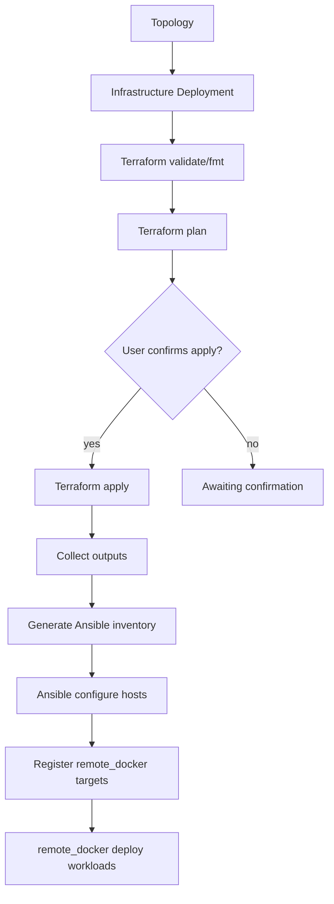

# Infrastructure Deployments (Step 57C / 57D / 57E)

Cloud Networking Studio orchestrates **Terraform provisioning**, **Ansible host configuration**, and **remote_docker workload deployment** as separate, auditable platform stages.

> **Not Kubernetes orchestration.** This step prepares runtime hosts. Kubernetes support comes later.

## Step 57E: Real GCP docker-vm apply/destroy

57E enables **real Terraform apply and destroy** for **GCP `docker-vm` only**, behind strict safety gates and typed user confirmation. AWS, custom templates, and arbitrary modules remain disabled.

| Capability | local/mock | GCP `docker-vm` | AWS `docker-vm` |
|------------|------------|-----------------|-----------------|
| `terraform init -backend=false` | mock or real | real | coming soon |
| `terraform validate` | yes | yes | — |
| `terraform plan` | yes | yes | — |
| `terraform apply` | mock in-process | **yes (gated)** | — |
| Destroy | mock after apply | **yes (gated)** | — |

### Apply flow (GCP only)

1. Create infrastructure deployment
2. Validate succeeds
3. Plan succeeds (plan stored in persistent workspace)
4. Safety checklist passes
5. User types **APPLY** and confirms
6. Terraform apply runs from stored `tfplan`
7. Outputs captured; optional Ansible host setup
8. `remote_docker` runtime target registered

Apply is **rejected** when:

- No successful plan exists
- Plan is stale after variable changes (re-run Plan)
- Provider/template not `gcp` + `docker-vm`
- Safety checks fail (machine type, region, vm_count, CIDR, credentials)
- Status is not `awaiting_confirmation`

### Safety limits

| Gate | Rule |
|------|------|
| Provider/template | `gcp` + `docker-vm` only |
| `vm_count` | ≤ 1 |
| Machine types | `e2-micro`, `e2-small`, `e2-medium` |
| Regions | `us-central1`, `us-west1`, `us-east1` |
| Zone | Must match selected region |
| Instance name | Must start with `cns-` |
| CIDR | `0.0.0.0/0` blocked unless `unsafe_testing_override` |
| Cost | UI shows: *This may create billable cloud resources.* |

### Destroy flow (GCP)

1. Deployment must be `succeeded` (applied)
2. User types **DESTROY**
3. Linked runtime targets deactivated
4. `terraform destroy -auto-approve` in stored workspace
5. Deployment marked `destroyed` (idempotent on repeat)

### Credentials

| credentials_ref | Server env var | Notes |
|-----------------|----------------|-------|
| `env:GOOGLE_APPLICATION_CREDENTIALS` | path to service account JSON | mount read-only in backend/runner |
| `env:GOOGLE_CREDENTIALS_JSON` | inline JSON | validated but never logged |

SSH for post-apply configuration and runtime targets uses:

| Purpose | Env var | Default path |
|---------|---------|--------------|
| Private key (runtime target `credentials_ref`) | `CNS_REMOTE_DOCKER_SSH_KEY_PATH` | `/opt/cns/secrets/gcp-remote-docker-key` |
| Public key (Terraform instance metadata) | `CNS_REMOTE_DOCKER_SSH_PUBLIC_KEY_PATH` | `/opt/cns/secrets/gcp-remote-docker-key.pub` |

CNS-created GCP Docker VMs automatically receive the public key via instance metadata (`ssh-keys`) with **OS Login disabled** (`enable-oslogin=FALSE`). The matching private key path is never stored in the database.

Registered runtime targets use:

- `credentials_ref=env:CNS_REMOTE_DOCKER_SSH_KEY_PATH`
- `ssh_user` from deployment variables (default `ubuntu`)
- `host` = Terraform `public_ip` output

If the public key file is missing or unreadable, validate/plan/apply are blocked with:

`CNS remote Docker SSH public key is not configured.`

Mount `/opt/cns/secrets:/opt/cns/secrets:ro` on backend and runner; set both env vars in compose.

Persistent Terraform workspaces: `/opt/cns/infra-workspaces/{deployment_id}` on the runner (mounted in production compose).

## Step 57D: Real Terraform validate + plan (GCP)

57D added real Terraform validate/plan for cloud providers. 57E extends this with gated apply/destroy for GCP `docker-vm`.

Templates live under:

```
infra_templates/terraform/gcp/docker_vm/
  main.tf
  variables.tf
  outputs.tf
```

The registry maps `docker-vm` + `gcp` → `terraform/gcp/docker_vm` via `provider_terraform_dirs`.

### GCP credentials_ref

Never store raw credentials in the database. Pass a server-side pointer:

| credentials_ref | Server env var | Notes |
|-----------------|----------------|-------|
| `env:GOOGLE_APPLICATION_CREDENTIALS` | path to service account JSON | mount file read-only in backend/runner |
| `env:GOOGLE_CREDENTIALS_JSON` | inline JSON | validated but never logged |

Example compose/backend env:

```bash
GOOGLE_APPLICATION_CREDENTIALS=/opt/cns/secrets/gcp-sa.json
```

Create deployment with `"credentials_ref": "env:GOOGLE_APPLICATION_CREDENTIALS"`.

If missing: `Terraform credentials_ref is not configured on the server.`

### Plan-only safety (historical 57D)

- Real cloud apply for non-GCP providers returns **409**
- Destroy without apply returns **409**: `Nothing to destroy: plan-only deployment.`
- local-mock confirm/apply/configure flow is unchanged.

### Terraform → runtime targets

After GCP apply, outputs (`public_ip`, `ssh_user`, `zone`, …) register a real `remote_docker` target with `source=terraform_gcp_docker_vm`.

## Architecture



### Execution path

```
FastAPI backend  →  Go runner POST /infra/executions  →  terraform | ansible-playbook
```

- Isolated workspaces: ephemeral `/tmp/cns-infra/{execution_id}` for validate; persistent `/opt/cns/infra-workspaces/{deployment_id}` for GCP plan/apply/destroy
- Whitelisted templates in `infra_templates/`
- Whitelisted playbooks in `ansible_playbooks/`
- No arbitrary module/playbook uploads
- Secrets redacted in persisted logs

## Stack components

| Layer | Responsibility |
|-------|----------------|
| **Terraform** | Provision VMs, networks, security groups, SSH access |
| **Ansible** | Install Docker, Compose, CNS runtime directories |
| **remote_docker** | Deploy topology containers to prepared hosts |

## Supported templates (initial)

| Template | Providers | Description |
|----------|-----------|-------------|
| `local-mock` | local, mock | Deterministic mock outputs for dev/CI |
| `gcp-vm` | gcp | GCP VM module composition |
| `aws-ec2` | aws | AWS EC2 module composition |
| `docker-vm` | local, mock, gcp, aws | Docker-ready VM stack |

Modules under `infra_templates/modules/`:

- `generic-vm`, `docker-vm`, `vpc-network`, `security-group`, `ssh-access`

## Deployment statuses

`pending` → `validating` → `validated` → `planning` → `awaiting_confirmation` → `applying` → `configuring` → `succeeded`

Destroy: `destroying` → `destroyed` (GCP: only after successful apply; typed **DESTROY** required)

## API

| Method | Path | Description |
|--------|------|-------------|
| GET | `/infrastructure/templates` | List whitelisted templates |
| GET | `/topologies/{id}/infrastructure-deployments` | List deployments |
| POST | `/topologies/{id}/infrastructure-deployments` | Create deployment (`credentials_ref` for cloud) |
| POST | `/infrastructure-deployments/{id}/validate` | Terraform init + fmt + validate |
| POST | `/infrastructure-deployments/{id}/plan` | Terraform plan (requires `validated`) |
| GET | `/infrastructure-deployments/{id}` | Deployment detail |
| GET | `/infrastructure-deployments/{id}/executions` | Execution logs/artifacts |
| POST | `/infrastructure-deployments/{id}/confirm` | Typed **APPLY** gate → apply + ansible (GCP docker-vm) |
| POST | `/infrastructure-deployments/{id}/destroy` | Typed **DESTROY** gate → terraform destroy |

## Confirmation gate

Terraform **apply** never runs automatically after plan. The UI shows:

- VM count
- Region/zone
- Exposed ports
- Host preview / public IPs

The user must POST `/confirm`:

- local/mock: `{ "confirm": true }`
- GCP docker-vm: `{ "confirm": true, "confirmation_text": "APPLY", "unsafe_testing_override": false }`

Destroy (GCP): `{ "confirmation_text": "DESTROY" }`

## Security restrictions

- Template/playbook allowlists only (`infra_templates/registry.json`)
- Per-template variable allowlists (unknown keys rejected)
- Variable keys sanitized (no secrets in `variables_json`; use `credentials_ref`)
- CIDR, region, zone, and machine type validation for GCP
- Path traversal rejected
- No arbitrary module upload, remote modules, custom provisioners, or backend config
- Terraform state contents are **not** exposed via API — only metadata (`state_metadata_json`)
- Local backend only (`-backend=false`); remote backends planned

## Troubleshooting (57D / 57E)

| Symptom | Cause | Fix |
|---------|-------|-----|
| `Terraform CLI is not installed in runner image` | runner image missing terraform | rebuild runner (`runner/Dockerfile` installs terraform) |
| `Terraform credentials_ref is not configured on the server` | missing env var or file | set `GOOGLE_APPLICATION_CREDENTIALS` or `GOOGLE_CREDENTIALS_JSON` on backend |
| `terraform init failed` | provider plugin download/auth | check network; verify service account has minimal roles |
| `terraform plan failed` | invalid variables or missing VPC | review plan logs in executions; confirm `network_name` exists |
| Apply rejected: plan stale | variables changed after plan | re-run Plan |
| Apply rejected: type APPLY | missing typed confirmation | enter exactly `APPLY` in confirm request |
| `stored terraform plan file missing` | workspace lost between plan and apply | ensure runner volume `/opt/cns/infra-workspaces` is mounted |
| Destroy rejected | plan-only or wrong status | apply first; use typed `DESTROY` |
| Ansible configuration pending | SSH not ready | verify VM SSH access; confirm `CNS_REMOTE_DOCKER_SSH_*` key pair on server and instance metadata |
| `CNS remote Docker SSH public key is not configured` | missing `.pub` file | set `CNS_REMOTE_DOCKER_SSH_PUBLIC_KEY_PATH`; mount `/opt/cns/secrets` |
| SSH permission denied on runtime target | OS Login enabled or key not in metadata | redeploy with updated Terraform template; ensure public key env is set before apply |

## Observability

Each deployment stores:

- **Event timeline** (`events_json`): validate started, plan completed, apply started, runtime ready, …
- **Metrics** (`metrics_json`): plan/apply/ansible durations, success/failure counters

Runner records infra operations in `/runtime/operations/recent`.

## Provider matrix

| Provider | Terraform | Ansible | Notes |
|----------|-----------|---------|-------|
| local/mock | mock executor | mock/local | Default for dev & CI |
| gcp | **real validate/plan/apply/destroy** (57E) | after apply | `credentials_ref` env pointers |
| aws | coming soon (docker-vm) | after future apply | stub rejected at create |

## Future: Kubernetes

After hosts are prepared and workloads run via `remote_docker`, Kubernetes orchestration will add:

- Cluster provisioning templates
- CNI/storage class configuration
- In-cluster runner targets

See `docs/ROADMAP.md`.

## Related docs

- [EXTERNAL_INFRA_DEPLOYMENT.md](./EXTERNAL_INFRA_DEPLOYMENT.md) — GCP release candidate smoke flow (57F)
- [EXTERNAL_DEPLOYMENTS.md](./EXTERNAL_DEPLOYMENTS.md) — remote_docker validate/plan/apply
- [STAGING_DEPLOYMENT.md](./STAGING_DEPLOYMENT.md) — platform hosting (separate from user infra stacks)
