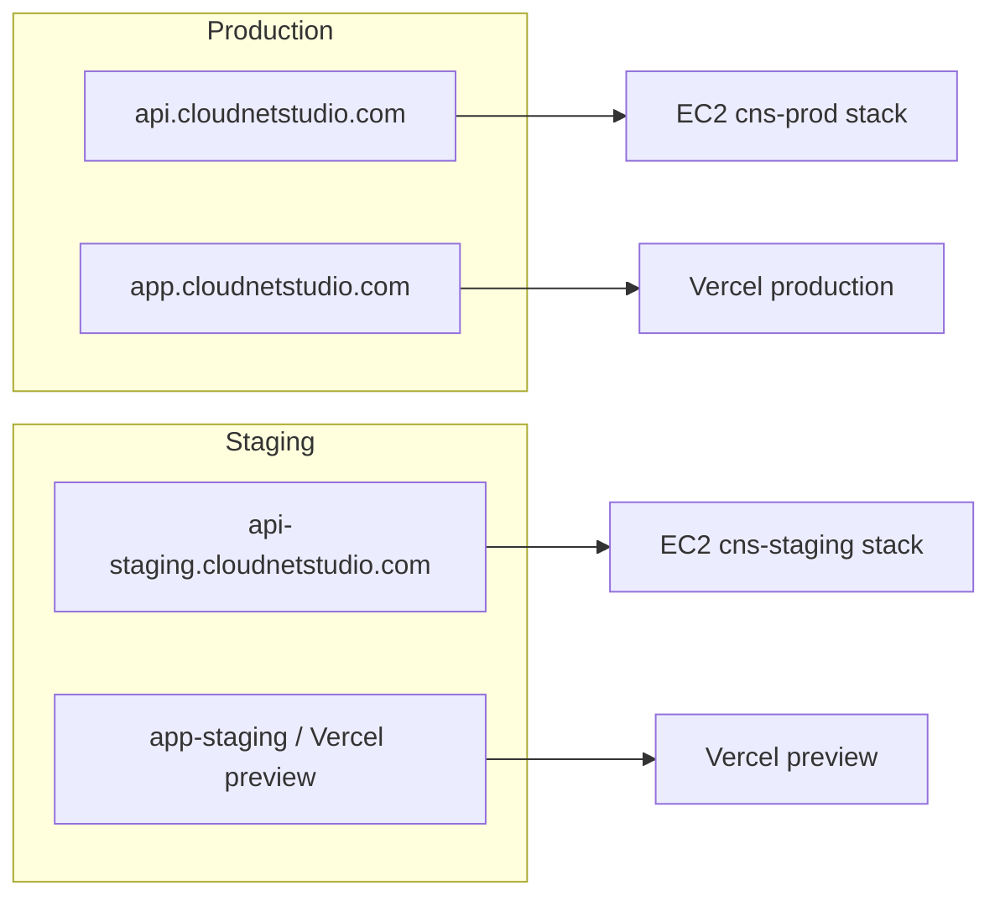

# Staging deployment (Step 55)

Test feature branches on an isolated **staging** stack without replacing **production**.

| | **Production** | **Staging** |
|--|----------------|-------------|
| Workflow | [`.github/workflows/deploy-production.yml`](../.github/workflows/deploy-production.yml) | [`.github/workflows/deploy-staging.yml`](../.github/workflows/deploy-staging.yml) |
| Trigger | Manual (`workflow_dispatch`) | Manual (`workflow_dispatch`), any branch |
| EC2 directory | `~/cloud-networking-studio` | `~/cloud-networking-studio-staging` |
| Compose project | `cns-prod` | `cns-staging` |
| API hostname (default) | `api.cloudnetstudio.com` | `api-staging.cloudnetstudio.com` |
| App hostname (default) | `app.cloudnetstudio.com` (Vercel prod) | `app-staging.cloudnetstudio.com` or Vercel preview URL |
| `CNS_ENVIRONMENT` | `production` | `staging` |
| Database | RDS or local Postgres (prod secrets) | **Local Compose Postgres only** (unless `STAGING_DATABASE_URL` is set explicitly) |
| Auth secret | `AUTH_SECRET_KEY` | `STAGING_AUTH_SECRET_KEY` (never prod secret by default) |

## Quick start

1. **Provision a staging EC2 host** (recommended: dedicated Elastic IP, separate from production).
   - Option A: set repository **Variable** `CNS_STAGING_TERRAFORM_ENABLED=true` — workflow applies Terraform with state key `cloud-networking-studio/staging/terraform.tfstate` (no RDS).
   - Option B: set repository **Secret** `CNS_STAGING_EC2_HOST` to the staging EC2 public IP.
2. **DNS (Cloudflare, DNS only / grey cloud):**
   - **A** `api-staging` → staging EC2 Elastic IP
   - **CNAME** `app-staging` → Vercel (or use a Vercel preview URL in CORS)
3. **GitHub → Actions → Deploy staging → Run workflow**
   - Choose the branch to deploy (or leave empty to use the branch selected in the UI).
4. Verify: `curl -s https://api-staging.cloudnetstudio.com/api/health | jq .environment` → `"staging"`.

Production deploy is unchanged — run **Deploy production** only when you intend to update prod.

## Architecture



Both stacks can run on **separate EC2 instances** (recommended) or on one host with **non-conflicting ports** (advanced — see co-location below).

## Compose files

Staging uses three overlays on the production base:

```bash
docker compose \
  -f docker-compose.prod.yml \
  -f docker-compose.caddy-https.yml \
  -f docker-compose.staging.yml \
  --env-file .env \
  up -d --build
```

- **`docker-compose.staging.yml`** sets project name **`cns-staging`**, `CNS_ENVIRONMENT=staging`, staging Caddyfile, and optional host port offsets.
- **`deploy/Caddyfile.staging-https`** — TLS site for `api-staging.cloudnetstudio.com`.
- Volumes are prefixed by project name (`cns-staging_postgres_data`, `cns-staging_caddy_data`, …) — **never** shared with `cns-prod_*`.

Remote deploy logic: [`scripts/staging_deploy_remote.sh`](../scripts/staging_deploy_remote.sh).

## Safety guarantees

The staging deploy script **refuses** to:

- Use `COMPOSE_PROJECT_NAME=cns-prod`
- Set `CNS_ENVIRONMENT=production`
- Point at a non-local `DATABASE_URL` unless **`STAGING_DATABASE_URL`** is explicitly provided
- Run `docker compose down -v` when `CNS_CADDY_AUTO_HTTPS=on` (protects staging TLS volumes)

It **never reads** `~/cloud-networking-studio/.env` for secrets. Production workflow **never** writes to `~/cloud-networking-studio-staging`.

## GitHub configuration

### Required (pick one host strategy)

| Secret / Variable | Required | Description |
|-------------------|----------|-------------|
| **`CNS_STAGING_EC2_HOST`** | Yes* | Staging EC2 public IP or hostname |
| **`CNS_STAGING_TERRAFORM_ENABLED`** | Alt | Repository variable `true` to create/manage staging EC2 via Terraform |
| **`EC2_SSH_USER`** | Yes | SSH user (same key as production deploy) |
| **`EC2_SSH_PRIVATE_KEY`** | Yes | SSH private key |
| **`AWS_*` / `TF_STATE_BUCKET`** | If using Terraform | Same as production infra secrets |

\*Not required when `CNS_STAGING_TERRAFORM_ENABLED=true`.

### Optional (recommended)

| Name | Description |
|------|-------------|
| **`STAGING_AUTH_SECRET_KEY`** | Staging JWT secret (≥32 chars). If unset, generated/stored in staging `.env` only. |
| **`STAGING_POSTGRES_PASSWORD`** | Staging Postgres password. If unset, generated on first deploy. |
| **`STAGING_DATABASE_URL`** | Explicit DSN — **do not** point at production RDS unless intentional. |
| **`CNS_STAGING_CORS_ORIGINS`** | Extra browser origins (Vercel preview URLs, etc.) |
| **`CNS_STAGING_API_HOST`** | Variable; default `api-staging.cloudnetstudio.com` |
| **`CNS_STAGING_APP_URL`** | Variable; default `https://app-staging.cloudnetstudio.com` |
| **`CNS_STAGING_TF_STATE_KEY`** | Variable; default `cloud-networking-studio/staging/terraform.tfstate` |

### Vercel (optional frontend)

If **`VERCEL_TOKEN`**, **`VERCEL_ORG_ID`**, and **`VERCEL_PROJECT_ID`** are set, the workflow builds with `VITE_API_BASE_URL=https://<staging-api>/api` and runs **`vercel deploy`** (preview, not `--prod`).

Add the preview URL to **`CNS_STAGING_CORS_ORIGINS`** if you use previews instead of `app-staging`.

## Co-location on one EC2 (advanced)

If staging shares a VM with production, **only one stack can bind host ports 80/443**. Options:

1. **Recommended:** use a **second EC2** for staging.
2. **Advanced:** set repository variables on staging deploy:
   - `CNS_STAGING_CADDY_HTTP_PORT=8080`
   - `CNS_STAGING_CADDY_HTTPS_PORT=8443`
   - `CNS_STAGING_POSTGRES_HOST_PORT=5434`

   Then configure DNS / Cloudflare origin rules to reach staging on those ports, or terminate both hostnames on a shared edge proxy.

## Smoke tests

CI runs:

```bash
CNS_BASE_URL=https://api-staging.cloudnetstudio.com \
CNS_SMOKE_API_ONLY=1 \
CNS_EXPECT_ENVIRONMENT=staging \
AUTH_SMOKE=0 \
./scripts/prod_smoke_test.sh
```

`GET /api/health` must return `"environment": "staging"`. Authenticated users can also check `GET /api/platform/security-status` → `"environment": "staging"`.

## Local validation

Validate compose config without deploying:

```bash
CNS_CADDY_SITE_ADDRESS=api-staging.cloudnetstudio.com \
SSLIP_HOST=api-staging.cloudnetstudio.com \
CNS_SSLIP_HOST=api-staging.cloudnetstudio.com \
CADDYFILE_CADDY=./deploy/Caddyfile.staging-https \
docker compose -f docker-compose.prod.yml -f docker-compose.caddy-https.yml -f docker-compose.staging.yml config
```

## Related docs

- [CICD_DEPLOYMENT.md](./CICD_DEPLOYMENT.md) — production deploy
- [EPHEMERAL_CI_ENVIRONMENTS.md](./EPHEMERAL_CI_ENVIRONMENTS.md) — throwaway PR EC2 (not staging)
