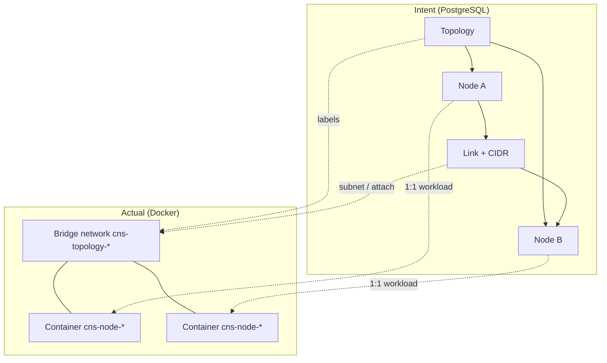
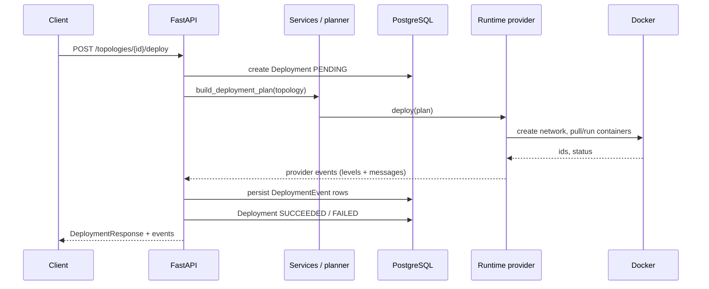
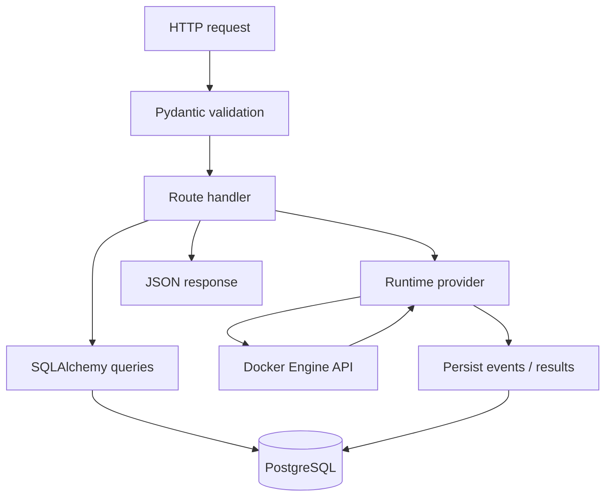

# Architecture

Cloud Networking Studio implements a **small but real control plane**: users express infrastructure as a **topology** (graph), the system **plans** and **applies** that intent via a **runtime provider**, records **deployment events**, and supports **inspection**, **traffic validation**, **failure injection**, and **reconciliation / healing**.

This document ties together persistence, APIs, services, and the Docker-backed runtime. It also explains **why** this project maps cleanly to distributed systems, cloud, and platform engineering interviews.

---

## Goals

1. **Separation of concerns:** topology/deployment state in PostgreSQL; Docker mutations isolated behind a provider.
2. **Auditability:** deployment events as an append-only narrative of what the platform did.
3. **Operability:** explicit APIs for “what’s running?”, “what drifted?”, “fix this deployment”.
4. **Extensibility:** swap or add runtime implementations without rewriting HTTP handlers.

---

## High-level components

| Layer | Responsibility |
|-------|----------------|
| **FastAPI** | HTTP API, OpenAPI, request validation (Pydantic) |
| **SQLAlchemy models** | Topologies, nodes, links, deployments, events, traffic tests, failure injections |
| **Services** | Deployment planning, runtime assembly, controller passes, traffic execution, failure injection |
| **Runtime provider** | Abstract operations (`deploy`, `destroy`, exec, stats, reconcile, heal) |
| **Docker SDK** | Concrete implementation for networks, containers, exec |

---

## Topology → deployment → runtime

1. **Topology** — Users create `Topology`, `TopologyNode`, and `TopologyLink` rows. This is the **desired state** (intent).
2. **Deployment** — `POST /topologies/{id}/deploy` creates a `Deployment`, builds a **deployment plan** from the loaded topology graph, and invokes the provider’s `deploy(plan)`.
3. **Runtime view** — Services project Docker state (and DB linkage) into API responses for topology-level or deployment-level **runtime** snapshots, plus node logs/stats.

---

## Mermaid: topology → runtime mapping

How declarative graph elements relate to provider-managed resources (Docker-oriented).

---

## Mermaid: deployment lifecycle

End-to-end lifecycle from API call to recorded events.

---

## Mermaid: API request flow

Typical path for a mutating request that touches Docker.

---

## Event logging model

Deployment operations emit **`DeploymentEvent`** records with a **level** (info, warning, error, etc.) and **message**. This produces:

- A **timeline** per deployment for demos and debugging.
- A foundation for **SSE/WebSocket** or log shipping later without changing the core domain model.

Inspection APIs may append informational events when users request logs/stats so operator activity is visible in the same stream.

---

## Controller and reconciliation (overview)

A **controller** service can:

- Report **status** (mode, counts, last run).
- Run a **reconcile pass** across deployments or for a single deployment.
- **Heal** a deployment by attempting to restore missing or stopped resources.

See [failure-recovery.md](failure-recovery.md) for reconciliation and healing diagrams.

---

## Why this demonstrates strong backend / cloud / distributed systems skills

| Theme | How CNS shows it |
|-------|------------------|
| **Control planes** | Intent in DB, reconcile vs actuals, explicit lifecycle APIs |
| **Idempotency & safety** | Destroy/teardown paths; labeled resources for scoped management |
| **Failure handling** | Deployment failure paths; structured events; HTTP mapping from domain errors |
| **Networking** | Links, addressing, container connectivity validation via traffic tests |
| **Concurrency & state** | Session-per-request DB pattern; provider calls serialized per operation |
| **Extensibility** | Provider interface allows alternative runtimes without rewriting HTTP layer |

---

## Related docs

- [runtime-provider.md](runtime-provider.md) — Docker orchestration flow and labeling.
- [failure-recovery.md](failure-recovery.md) — Reconciliation and healing pipeline.
- [traffic-testing.md](traffic-testing.md) — How ping/HTTP tests run between containers.
- [repository-layout.md](repository-layout.md) — Where code lives in the repo.
