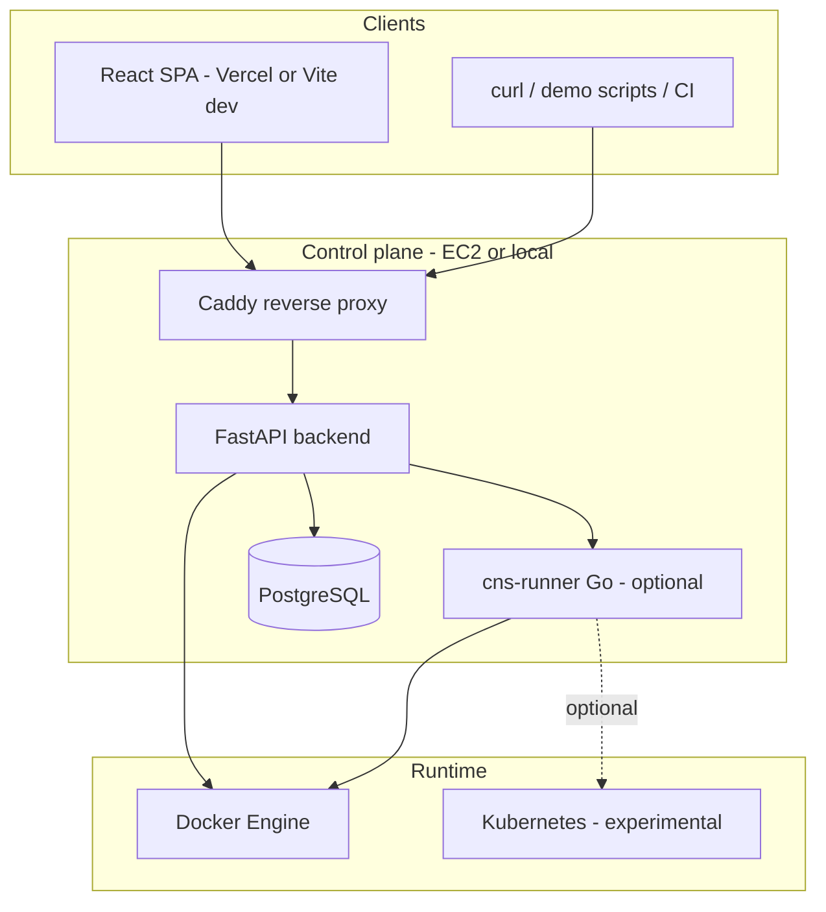
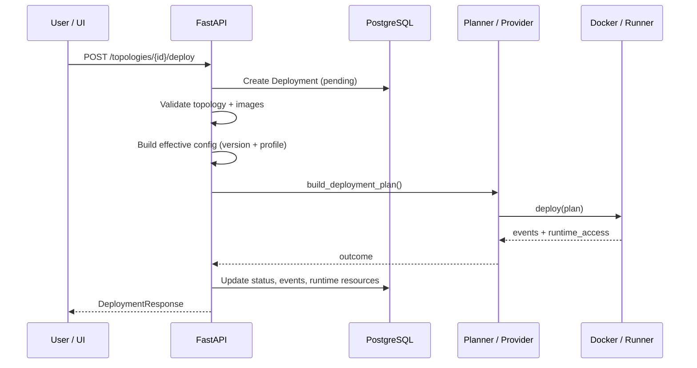
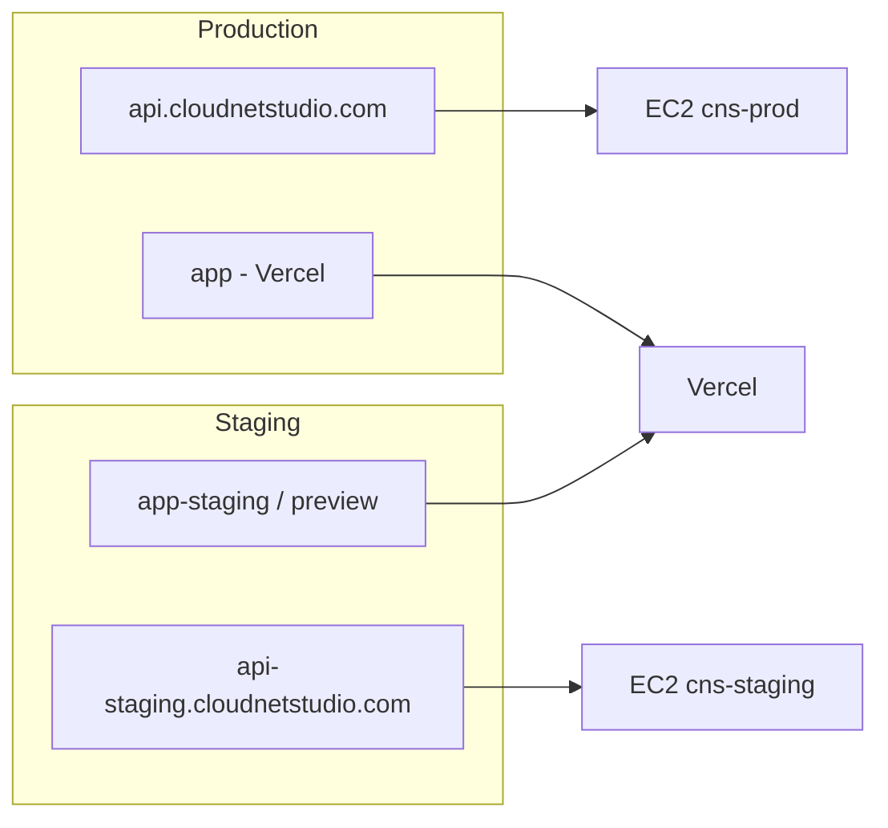
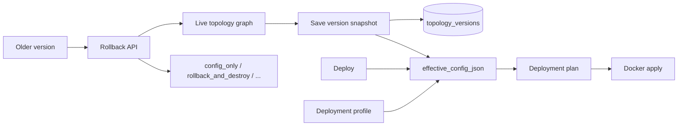

# Architecture

Cloud Networking Studio (CNS) is a **control plane** for network lab topologies: users define graphs in a React UI, the API persists intent in PostgreSQL, and a **runtime provider** materializes Docker (or optionally Kubernetes) resources. Clients include the SPA, `curl`, CLI scripts, and GitHub Actions smoke tests — all hit the same REST API.

For deeper API diagrams, see [system-architecture.md](system-architecture.md). For Docker naming and labels, see [runtime-provider.md](runtime-provider.md).

---

## High-level components

| Component | Role |
|-----------|------|
| **Frontend** | Topology studio (React Flow), deploy/runtime panels, metrics, tokens, notifications |
| **FastAPI** | Auth, CRUD, deploy orchestration, traffic/failure APIs, exports, metrics |
| **PostgreSQL** | Users, projects, topologies, deployments, versions, profiles, events, audit |
| **Runtime provider** | Abstracts deploy/destroy/inspect/reconcile/heal; Docker is primary |
| **Go runner** | Optional sidecar for richer deploy plans and runtime operations (`RUNTIME_EXECUTOR=go`) |

Observability: `GET /runtime/runner-status`, `GET /runtime/operations/recent`, runner `/health` · `/status` · `/version`. See [GO_RUNNER.md](GO_RUNNER.md).
| **Caddy** | TLS termination and `/api` reverse proxy on EC2 stacks |

---

## Frontend architecture

**Routes** (`frontend/src/App.tsx`):

| Path | Page |
|------|------|
| `/dashboard` | Topology list, onboarding checklist, optional demo start |
| `/topologies/:id` | Studio, deploy, runtime, traffic, versions, profiles, exports |
| `/templates` | Runtime template library |
| `/platform-metrics`, `/platform-security` | Operator views |
| `/api-tokens`, `/notifications` | Automation and alerts |
| `/invitations/accept` | Team invite flow |

The UI calls `/api/*` (Vite proxy in dev; absolute API URL on Vercel production builds via `VITE_API_BASE_URL`).

---

## Backend architecture

**Router modules** (see `backend/app/main.py`):

- **Identity & access:** `auth`, `projects`, `project_invitations`, `api_tokens`
- **Topology:** `topologies`, `topology_versions`, `deployment_profiles`, `topology_exports`, `templates`
- **Deploy & runtime:** `deployments`, `runtime`, `controller`, `terminal`
- **Lab ops:** `traffic_tests`, `failure_injections`
- **Platform:** `metrics`, `platform_metrics`, `notifications`, `audit_logs`, `onboarding`

Handlers stay thin; domain logic lives in `backend/app/services/`. Docker SDK usage is confined to `backend/app/providers/`.

---

## API flow (typical deploy)

**Destroy:** `POST /deployments/{id}/destroy` → provider teardown → `status=stopped`, `cleanup_status` set.

**Runtime read:** `GET /topologies/{id}/runtime` merges latest deployment metadata with live provider inspection (graceful empty/degraded states — no 500 for missing runtime).

---

## Runtime provider model

| `runtime_target` | Default behavior |
|------------------|------------------|
| `docker` | Python Docker provider and/or Go runner (`RUNTIME_EXECUTOR=go` in prod compose) |
| `kubernetes` | Go runner Kubernetes path (**experimental**; segmented multinet not supported in runner) |

**Flat topology:** one logical segment → typically one bridge network.

**Routed / multi-network:** distinct `network_name` per link → segmented mode: multiple bridges, router nodes with forwarding, static endpoint IPs on links.

---

## Staging vs production

Both use **separate EC2 stacks** (recommended) or isolated compose project names on one host.

| | Staging | Production |
|--|---------|------------|
| Workflow | `deploy-staging.yml` | `deploy-production.yml` |
| Trigger | Manual, any branch | Manual |
| `CNS_ENVIRONMENT` | `staging` | `production` |
| API host | `api-staging.cloudnetstudio.com` | `api.cloudnetstudio.com` |
| SPA | Vercel preview / staging URL | Vercel production |
| DB | Compose Postgres (default) | RDS or Compose (your secrets) |
| Auth secret | `STAGING_AUTH_SECRET_KEY` | `AUTH_SECRET_KEY` |

Details: [STAGING_DEPLOYMENT.md](STAGING_DEPLOYMENT.md) · [CICD_DEPLOYMENT.md](CICD_DEPLOYMENT.md)

---

## Topology versioning and profiles

- **Versions** — immutable snapshots (manual, deploy, rollback). See [TOPOLOGY_VERSIONING_AND_PROFILES.md](TOPOLOGY_VERSIONING_AND_PROFILES.md).
- **Profiles** — per-topology overrides (env, image tags, expose policy) merged at deploy time.
- **Rollback** — restores graph from a version; optional destroy of active deployments before mutation.

---

## Integration outputs and IaC export

| Feature | Endpoint area |
|---------|----------------|
| Integration snippets & downloads | `GET /deployments/{id}/integration-outputs` (+ files/archive) |
| IaC preview | `GET /topologies/{id}/exports/preview` |
| Downloads | docker-compose, kubernetes, **terraform**, **ansible**, zip archive |

IaC exports are **generated artifacts** from topology intent — useful for demos and CI, not a full Terraform/Ansible lifecycle manager.

---

## Security boundaries

- JWT + project membership on protected routes (`AUTH_REQUIRE_LOGIN=true` in staging/prod).
- API tokens with scoped access for automation.
- CORS configured per environment (`CNS_CORS_ORIGINS`, staging workflow merges required origins).
- Docker socket / runner access = privileged host operations — isolate EC2 and restrict runner network.

See [AUTH.md](AUTH.md) · [TEAM_COLLABORATION.md](TEAM_COLLABORATION.md) · [PRODUCTION_READINESS.md](PRODUCTION_READINESS.md)

---

## Related docs

| Document | Topic |
|----------|--------|
| [system-architecture.md](system-architecture.md) | Extended diagrams |
| [runtime-provider.md](runtime-provider.md) | Docker mapping |
| [traffic-testing.md](traffic-testing.md) | Ping/HTTP execution |
| [failure-recovery.md](failure-recovery.md) | Reconcile/heal |
| [INTEGRATION_OUTPUTS.md](INTEGRATION_OUTPUTS.md) | Deployment integration files |
| [OBSERVABILITY.md](OBSERVABILITY.md) | Metrics and timelines |
