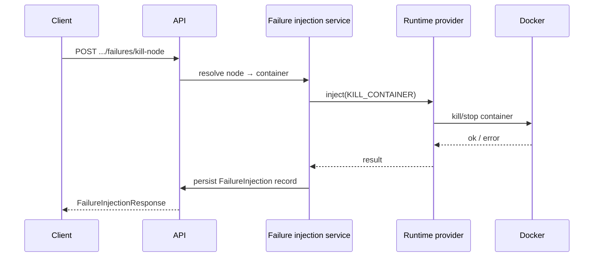
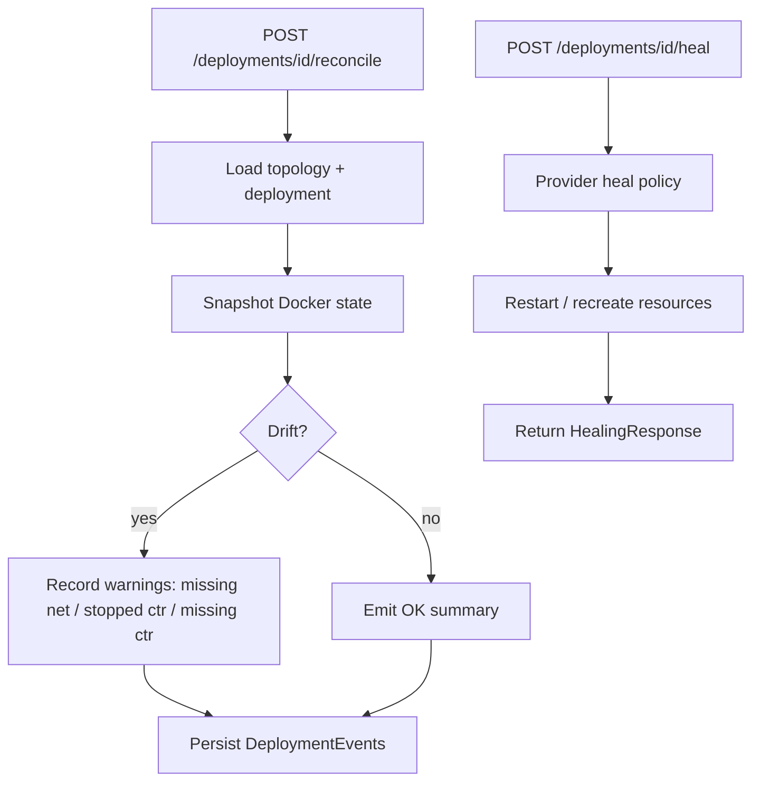

# Failure injection & recovery

This platform supports **controlled failures** on running workloads, **drift detection** via reconciliation, and **targeted healing** to restore expected state. Together they demonstrate patterns common to **orchestrators**, **SRE tooling**, and **chaos engineering** — at a scale suitable for a portfolio project.

---

## Concepts

| Term | Meaning |
|------|---------|
| **Desired state** | Topology + deployment records (what should exist) |
| **Actual state** | Live Docker networks and containers |
| **Drift** | Mismatch between desired and actual (stopped container, missing network, etc.) |
| **Reconciliation** | Read-only-ish comparison that emits structured findings (and API-level events) |
| **Healing** | Mutating recovery (restart/recreate) guided by provider policy |

---

## Failure injection API

Failure routes operate on the **container backing a node**:

- **Stop** — graceful stop (SIGTERM-style via Docker stop semantics)
- **Restart** — restart policy path through Docker
- **Kill** — hard termination

These are exposed as HTTP endpoints under a topology scope so demos can narrate “kill the service” without shell access to the host.

---

## Mermaid: failure injection flow

---

## Reconciliation pipeline

Reconciliation answers: **“Given this deployment, what is wrong in Docker right now?”**

Typical checks include:

- Managed **network** presence
- Per-node **container** presence
- **Stopped** vs running containers

API routes persist human-readable **deployment events** summarizing findings so the event stream tells a story suitable for logs or a future UI.

---

## Mermaid: runtime reconciliation / healing flow

The **controller** can also run a **scheduled pass** (`POST /controller/run-once`) to scan multiple deployments — useful when simulating a periodic reconciler.

---

## Self-healing semantics

Healing is **best-effort** and **provider-defined**:

- Some problems are fixed by **restarting** containers.
- Some problems require **recreating** missing resources if the provider implements that path.
- Some drift may be **unsafe or impossible** to auto-fix — responses and events should be inspected.

This mirrors real systems: **not all drift is auto-healable**.

---

## Event stream narrative

A compelling demo sequence:

1. Deploy successfully — events show provisioning steps.
2. Inject failure — container stops or dies.
3. Reconcile — warnings appear for stopped/missing resources.
4. Heal — recovery actions appear; subsequent runtime inspection shows recovery.

---

## Why interviewers care

- **Declare desired state, observe actual state, reconcile** — Kubernetes / Terraform / cloud control planes.
- **Chaos / fault injection** — resilience testing discipline.
- **Idempotent remediation** — careful ordering and avoiding destructive surprises.

---

## See also

- [system-architecture.md](system-architecture.md)
- [runtime-provider.md](runtime-provider.md)
