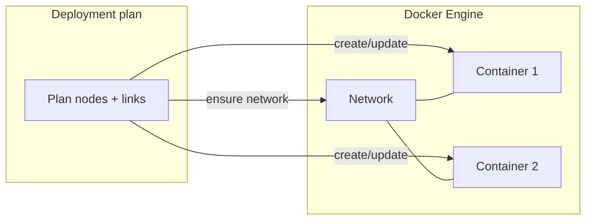
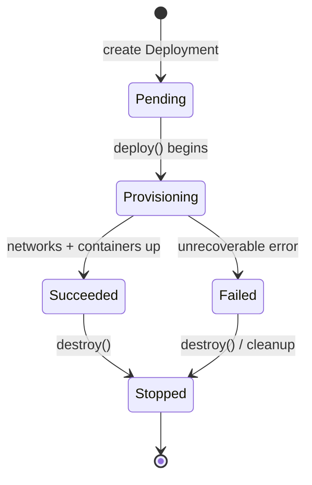

# Runtime provider (Docker)

The **runtime provider** is the bridge between the control plane’s **deployment plan** and **Docker Engine**. For topologies with `runtime_target` set for Docker, the provider creates **networks** and **containers**, attaches workloads with stable **labels**, executes **health-style checks** indirectly via traffic tests, and implements **reconciliation** and **healing** by inspecting live Docker state.

---

## Design principles

1. **Labels over ad hoc names:** Resources carry `cns.*` labels so listing and reconciliation can find “what belongs to this topology/deployment/node”.
2. **Plan-driven provisioning:** The planner turns topology nodes/links into a **`DeploymentPlan`** consumed by the provider — the HTTP layer does not embed Docker specifics.
3. **Observable transitions:** Provider operations return structured events (`ProviderEvent`) that become **deployment events** in PostgreSQL.
4. **Local-first:** Docker is ideal for portfolio demos and CI-friendly integration tests; the same boundaries support other backends later.

---

## Key responsibilities

| Operation | Purpose |
|-----------|---------|
| **deploy(plan)** | Create network(s), run containers with commands/images derived from nodes |
| **destroy(topology_id, deployment_id)** | Remove managed containers/networks for that deployment scope |
| **exec / logs / stats** | Bridge for traffic tests and runtime inspection routes |
| **reconcile** | Compare expected topology/deployment to Docker actuals |
| **heal** | Attempt restarts/recreation per policy when drift is detected |

---

## Docker orchestration flow (conceptual)

### Network naming

Topology-scoped networks use predictable names derived from the topology id (e.g. `cns-topology-{short}`), enabling reconciliation to locate the right bridge network.

**Segmented mode:** when links declare **more than one** `network_name`, the provider instead creates **one labeled bridge per segment** (deterministic name per topology + logical network). Each segment gets IPAM from that link’s **CIDR**. The **Docker IPAM `gateway`** is bound to the **Linux bridge** on the host and **must not** duplicate any container static IPv4 on that segment (otherwise attach fails with “Address already in use”). CNS therefore picks a bridge gateway from the subnet **excluding** all link `source_ip` / `target_ip` values (typically high host addresses such as `.254`), while **topology `gateway`** and router **NIC** addresses stay on the intended lab IPs (e.g. `10.72.0.1`) for default routes and forwarding. Nodes are **`connect`**ed to every segment they touch; **routers** therefore appear on multiple bridges. Synthetic **`ethN` ordering** in the API follows a stable sort of Docker network names so `eth0 → net-a`, `eth1 → net-b` style mappings are reproducible. After attach, **default routes** on leaf containers target the **router IP on that segment** (link endpoint / gateway intent), replacing Docker’s bridge-gateway default where needed so ping/HTTP can cross subnets.

---

Containers combine topology/node identity into **names** and **labels** (`cns.topology_id`, `cns.node_id`, `cns.managed`, project labels). This mirrors how Kubernetes and other systems tie workloads back to higher-level objects.

### Images and commands

Nodes carry **image** references; the provider resolves defaults and chooses sensible **commands** (for example, keeping general-purpose images attached with a long-running command while web images use image defaults).

---

## Runtime lifecycle

---

## Topology → Docker mapping (reference)

| Topology concept | Docker artifact |
|------------------|-----------------|
| Topology | User-defined bridge network + labels |
| Node | Container (image, env, static IP where configured) |
| Link | Shared network attachment + subnet (CIDR) intent; in segmented mode, **one bridge per distinct `network_name`** |

Exact behavior evolves with the planner and provider; treat the **API and labels** as the contract for automation and reconciliation.

---

## Why this is “real” cloud networking practice

- **Intent vs actuals** matches how VPCs, subnets, and workload attachments are reasoned about in AWS/GCP/Azure — here compressed into a lab-sized model.
- **Label-based reconciliation** is analogous to **label selectors** in Kubernetes and **resource tagging** in cloud accounts.
- **Provider boundary** matches how teams isolate **IaC**, **cluster APIs**, and **cloud SDKs** from product HTTP handlers.

---

## See also

- [architecture.md](architecture.md) — System context.
- [failure-recovery.md](failure-recovery.md) — Drift detection and healing.
- [traffic-testing.md](traffic-testing.md) — Exec-based connectivity checks.
