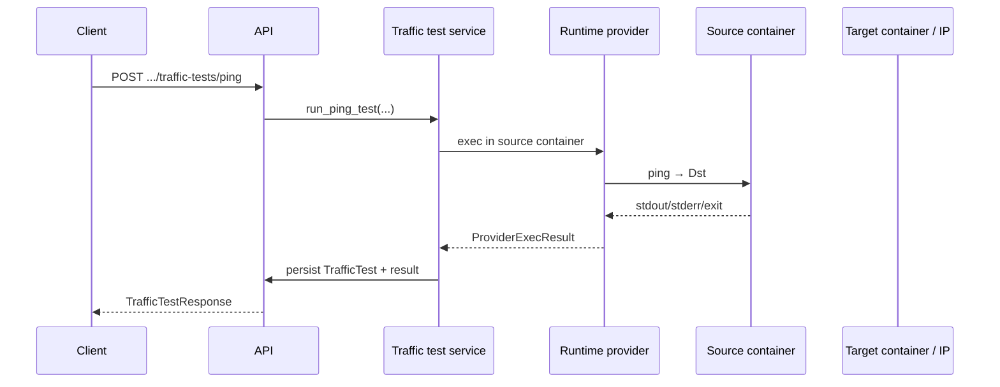

# Traffic testing

Traffic tests validate **connectivity and basic application behavior** between nodes **after deployment**. They complement static topology definitions by proving that Docker networking and process behavior match expectations — similar to **synthetic checks** or **canaries** in production platforms.

---

## Model

| Aspect | Behavior |
|--------|----------|
| **Scope** | Per topology; ties into deployed workloads |
| **Types** | ICMP-style **ping** and **HTTP** requests |
| **Execution** | Commands run **inside** a source container targeting the destination |
| **Persistence** | Records store command, status, stdout/stderr, latency where available |

The API returns a **`TrafficTestResponse`** including optional **`TrafficTestResultResponse`** details suitable for demos and future dashboards.

---

## Ping tests

Ping flows typically:

1. Resolve **source** and **target** nodes to running containers.
2. Issue a ping command from the source container’s network namespace toward the target address or container identity as implemented.
3. Capture exit code, stdout/stderr, and approximate latency.

**Use cases:** L3 reachability, MTU/path smoke checks in a lab topology.

---

## HTTP tests

HTTP flows typically:

1. Resolve containers as above.
2. Perform an HTTP GET from the source context to the target **IP/DNS as modeled**, on a configurable **port** and **path**.
3. Validate response characteristics at the level implemented by the service (status/body capture).

**Use cases:** “Service is actually serving HTTP”, not just ICMP reachability.

---

## Mermaid: traffic testing flow

---

## Failure injection interaction

Traffic tests are ideal **before and after** fault injection:

1. Baseline ping/HTTP succeeds.
2. Stop/kill target node container.
3. Traffic test should fail or degrade deterministically.
4. Heal/restart and re-run traffic tests to demonstrate recovery.

---

## Why this demonstrates networking skill

- **End-to-end validation** rather than only declaring links in a database.
- **Container networking** — namespaces, DNS between containers, address assignment.
- **Operational realism** — synthetic probes mirror Datadog/Dynatrace-style checks at a tiny scale.

---

## See also

- [failure-recovery.md](failure-recovery.md)
- [runtime-provider.md](runtime-provider.md)
